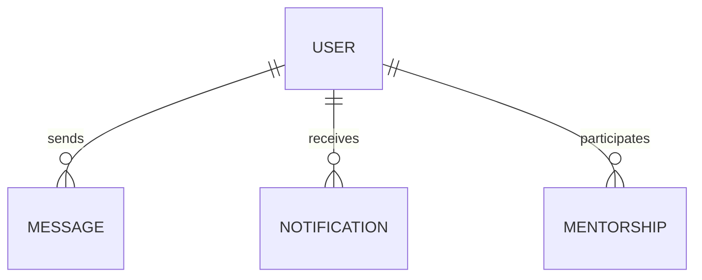
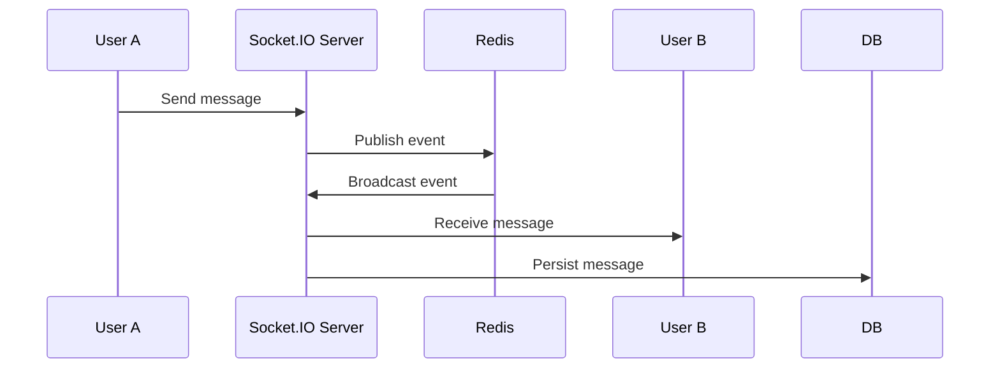

# MASTER PROMPT — GENERATE A COMPLETE, CODE-EVIDENCE-BASED PROJECT REPORT FOR ALUMNEX CONNECT

## ROLE

Act as a senior software architect, full-stack engineer, cybersecurity reviewer, DevOps engineer, database designer, QA engineer, technical writer, and academic project-documentation specialist.

You are preparing a **professional, extremely detailed, evidence-based software project report** for the project:

**Project Name:** Alumnex Connect  
**Repository:** https://github.com/SrimanKumarV/FSD/tree/master/alumni-connect-website-main  
**Repository branch:** `master`

The report will be submitted as **documentary/evidentiary proof of the implementation work performed on the project**.

This is NOT a generic project description.

The report must demonstrate:

1. What was built.
2. How it was built.
3. Why each architectural/technical decision was made.
4. How the frontend, backend, database, APIs, external services, AI, real-time communication, authentication, security, caching, automation, testing, deployment, and mobile components interact.
5. What fallback mechanisms exist.
6. What defensive mechanisms exist.
7. What optimizations exist.
8. What edge cases were considered.
9. What happens when dependencies fail.
10. What happens when invalid/malicious input is supplied.
11. What happens when users lack permission.
12. What happens when external APIs fail.
13. What happens when Redis is unavailable.
14. What happens when AI providers fail.
15. How authentication is maintained.
16. How data flows through the system.
17. How the application behaves during normal, abnormal, and failure scenarios.
18. What testing and CI/CD mechanisms exist.
19. What deployment architecture exists.
20. What limitations exist.
21. Which features are implemented, partially implemented, planned, mocked, or only documented.
22. Which claims are directly supported by source code and which are assumptions.

The final report must read like a **serious engineering document / final-year software engineering project report / technical architecture dossier**, not like marketing material.

---

# CRITICAL INSTRUCTION — CODE IS THE SOURCE OF TRUTH

Before writing the report, inspect the repository deeply.

Do NOT assume functionality merely because:

- a dependency exists,
- a route name suggests a feature,
- a README claims something,
- a documentation file mentions something,
- a UI component exists,
- a TODO mentions future work,
- an API is listed as planned,
- or an external service is named in documentation.

Every major technical claim must be classified as one of:

### A. VERIFIED IMPLEMENTATION
Directly supported by actual source code.

### B. PARTIALLY IMPLEMENTED
Some implementation exists, but it is incomplete or conditional.

### C. MOCK / DEMO IMPLEMENTATION
The application intentionally returns simulated/demo data.

### D. CONFIGURATION-DEPENDENT
The functionality works only when environment variables/external services are configured.

### E. DOCUMENTED / PLANNED
Mentioned in documentation or TODOs but not fully implemented in source code.

### F. INFERRED ARCHITECTURAL BEHAVIOR
Reasonable inference from source code, but not explicitly implemented.

Never present B, C, D, E or F as A.

For every important claim, identify the relevant:

- file path,
- function,
- route,
- middleware,
- model,
- utility,
- configuration,
- workflow,
- dependency,
- environment variable,
- or code block.

Where possible, mention exact filenames and functions in the report.

---

# REPOSITORY INVESTIGATION PHASE

Before writing anything, perform a complete repository audit.

Inspect at minimum:

## 1. Root structure

Analyze:

- `alumni-connect-website-main`
- frontend
- backend
- UI/shared components
- mobile wrapper
- APK-related material
- scripts
- docs
- `.github`
- configuration files
- package manifests
- lock files
- deployment files
- test files
- generated/build artifacts
- environment templates
- CI/CD workflows

Create a verified project tree.

---

# 2. COMPLETE FRONTEND AUDIT

Inspect the entire frontend.

Identify:

- framework
- React version
- routing architecture
- page hierarchy
- component hierarchy
- reusable UI components
- state management
- API communication
- Axios configuration
- authentication state
- token handling
- protected routes
- role-specific UI
- forms
- validation
- error handling
- loading states
- empty states
- retry mechanisms
- toast notifications
- modals
- pagination
- search
- filtering
- sorting
- lazy loading
- intersection observer usage
- animations
- responsive design
- accessibility
- charts
- maps
- 3D components
- drag-and-drop
- markdown rendering
- syntax highlighting
- file uploads
- PDF handling
- mobile compatibility
- API fallback logic
- frontend environment variables
- production build configuration

For each major frontend feature explain:

### Feature
### User goal
### UI flow
### Components involved
### API calls
### Backend dependency
### State changes
### Validation
### Error handling
### Loading behavior
### Empty-state behavior
### Permission behavior
### Fallback behavior
### Security considerations
### Performance considerations
### Accessibility considerations
### Evidence in source code

Do not simply list React libraries. Explain **why each important library is used in this application**.

---

# 3. COMPLETE BACKEND AUDIT

Inspect the backend comprehensively.

Document:

- Express application initialization
- HTTP server
- Socket.IO
- Redis adapter
- MongoDB connection
- middleware sequence
- route registration
- authentication middleware
- authorization middleware
- validation
- sanitization
- rate limiting
- CORS
- CSRF protection
- Helmet
- HPP
- compression
- logging
- error middleware
- 404 handling
- unhandled rejection handling
- uncaught exception handling
- scheduled jobs
- self-ping/availability mechanisms
- graceful/fallback mechanisms
- environment-dependent behavior
- test-mode behavior

Pay special attention to the exact **middleware ordering** and explain why the order matters.

Produce a backend request lifecycle such as:

```text
Client
  ↓
HTTP Request
  ↓
CORS
  ↓
Security Headers
  ↓
Compression
  ↓
Logging
  ↓
Rate Limiter
  ↓
Body Parser
  ↓
Cookie Parser
  ↓
CSRF Protection
  ↓
Mongo Query Sanitization
  ↓
HTTP Parameter Pollution Protection
  ↓
Authentication
  ↓
Authorization
  ↓
Validation
  ↓
Controller / Route
  ↓
Service / Utility
  ↓
Database / Redis / External API
  ↓
Response
  ↓
Error Handling if necessary
```

Only include stages actually supported by the implementation.

---

# 4. AUTHENTICATION AND AUTHORIZATION DEEP AUDIT

This section must be extremely detailed.

Inspect all authentication-related files.

Document:

- local registration
- login
- JWT
- cookies
- Bearer authorization fallback
- token verification
- token refresh
- logout
- password change
- forgot password
- password reset
- email verification
- resend verification
- 2FA
- email-based 2FA
- SMS-based 2FA
- Google OAuth
- GitHub OAuth
- OAuth completion
- role selection
- mobile authentication
- account activation/deactivation
- verification state
- approval state
- role hierarchy
- resource ownership
- admin authorization
- student authorization
- alumni authorization
- moderation authorization
- mentor authorization
- job-post permissions
- event-creation permissions
- contest permissions
- forum permissions

Build a complete authorization matrix.

Example:

| Capability | Student | Alumni | Admin | Verified Required | Approved Required |
|---|---:|---:|---:|---:|---:|
| Request mentorship | ✓ | — | — | ? | ? |
| Act as mentor | — | ✓ | ✓ | ? | ✓ |
| Post jobs | — | ✓ | ✓ | ? | ? |
| Create events | — | ✓ | ✓ | ? | ? |
| Moderate content | — | ✓ | ✓ | ? | ? |
| Admin operations | — | — | ✓ | ? | ? |

Do not invent values.

Derive every value from actual authorization middleware.

Explain:

- authentication vs authorization
- identity verification
- RBAC
- ownership-based authorization
- privilege boundaries
- inactive account behavior
- verified account behavior
- approved alumni behavior
- unauthorized request handling
- token failure handling
- cookie security
- same-site policy
- HTTP-only protection
- production secure-cookie behavior
- OAuth risks
- mobile deep-link behavior

Include security threat considerations such as:

- token theft
- privilege escalation
- broken access control
- IDOR
- brute-force login
- session misuse
- unauthorized resource modification
- account takeover

Only claim mitigations that actually exist.

---

# 5. SECURITY AUDIT

Create a dedicated full security chapter.

Inspect every available security mechanism.

At minimum investigate:

- Helmet
- CSP
- frameguard
- CORS
- credentials
- rate limiting
- authentication rate limiting
- express-validator
- input normalization
- Mongo sanitization
- HPP
- CSRF
- cookie configuration
- JWT verification
- password hashing
- environment secrets
- API-key handling
- upload restrictions
- file type validation
- PDF processing
- error disclosure
- production vs development error messages
- logging
- OAuth
- external API authentication
- privilege checks
- ownership checks
- spam/profanity moderation
- notification abuse
- chat abuse
- AI prompt handling
- external API failures
- dependency exposure
- mobile authentication
- HTTPS assumptions
- deployment configuration

For each security mechanism use this structure:

### Threat
### Attack scenario
### Existing mitigation
### Exact implementation
### Failure behavior
### Residual risk
### Evidence
### Possible future improvement

Do NOT falsely state that the application is “fully secure”.

Use precise language such as:

- “mitigates”
- “reduces risk”
- “provides protection against”
- “does not completely eliminate”
- “requires deployment-level HTTPS”
- “configuration-dependent”

---

# 6. DATABASE DEEP DIVE

Identify every MongoDB/Mongoose model.

The documentation indicates approximately 23 models; verify the actual current implementation.

Document each model individually.

For each model:

### Model name
### Purpose
### Important fields
### Relationships
### References
### Embedded documents
### Validation
### Defaults
### Indexes
### Timestamps
### Unique constraints
### Status fields
### Lifecycle
### Security considerations
### Related routes
### Related services
### Query patterns
### Aggregations if present
### Performance considerations

Create:

## Entity Relationship Diagram

Use Mermaid where possible.

Example:



Do not invent relationships. Derive them from schemas.

Also identify:

- one-to-one
- one-to-many
- many-to-many
- reference-based relationships
- denormalization decisions
- population
- aggregation
- indexing
- query optimization
- pagination
- projections
- caching

---

# 7. API INVENTORY

Create a complete API catalog.

For EVERY route, document:

| Method | Endpoint | Authentication | Authorization | Validation | Purpose | Success | Failure |
|---|---|---|---|---|---|---|---|

Categorize APIs into:

- Authentication
- Users
- Mentorship
- Jobs
- Events
- Forum
- Contests
- Messages
- Admin
- Notifications
- Upload
- Developer Activity
- Leaderboard
- Feedback
- Helpdesk
- Projects
- Institutions
- Tasks
- AI
- Tech Hub
- Business
- etc.

For every major endpoint describe:

### Request
### Validation
### Authorization
### Business logic
### Database interaction
### External API interaction
### Cache interaction
### Side effects
### Notifications
### Error paths
### Fallback paths
### Response

---

# 8. FEATURE-BY-FEATURE BUSINESS FLOW

Do NOT merely describe modules.

For every major feature construct a complete workflow.

At minimum inspect and document:

## Authentication

```text
User
 ↓
Registration/Login
 ↓
Validation
 ↓
Authentication
 ↓
Verification
 ↓
Role selection if required
 ↓
JWT/session establishment
 ↓
Protected application
```

## Mentorship

Document:

```text
Student
 ↓
Discover mentor
 ↓
View mentor profile
 ↓
Request mentorship
 ↓
Validation
 ↓
Authorization
 ↓
Mentor receives notification
 ↓
Mentor accepts/rejects
 ↓
Mentorship lifecycle
 ↓
Session
 ↓
Review / reward / completion
```

Modify this flow based on actual implementation.

## Jobs

Document:

- internal jobs
- external jobs
- job applications
- resume processing
- AI matching
- notifications
- filtering
- error/fallback behavior

## Events

Document:

- creation
- publishing
- RSVP
- calendar
- notifications
- permissions
- cancellation/update behavior

## Forum

Document:

- post creation
- validation
- moderation
- comments
- votes
- notifications
- reporting if implemented

## Messaging

Document:

- one-to-one messages
- group chat
- Socket.IO
- Redis
- online state if implemented
- notifications
- persistence
- reconnection
- multi-instance scaling

## Contests

Document:

- contest lifecycle
- submission
- code evaluation
- Judge0 integration
- any fallback/mock/planned status
- leaderboard
- anti-abuse mechanisms
- submission state

## AI

This section must be exceptionally detailed.

---

# 9. AI ARCHITECTURE DEEP DIVE

Inspect every AI-related file.

Document every AI capability, including:

- AI Career Mentor
- chat
- resume analysis
- ATS analysis
- job matching
- mentorship request drafting
- mock interviews
- interview evaluation
- other AI endpoints

Explain:

### Input
### Prompt/system instruction
### Context/history
### Model selection
### Primary provider
### Fallback provider
### JSON mode
### Parsing
### Error handling
### Mock mode
### User-visible fallback
### Authentication requirement
### File handling
### PDF parsing
### External API dependency
### Cost implications
### Failure scenarios

Especially document the provider failover architecture.

For example:

```text
AI Request
    ↓
Groq
    ↓
Success ─────────────→ Response
    │
    └── Failure
          ↓
        Gemini
          ↓
       Success ─────→ Response
          │
          └── Failure
                ↓
             Error / user fallback
```

Verify the actual code before presenting this.

Also document when the application intentionally enters demo/mock mode because no AI provider key is configured.

Explicitly distinguish:

- real AI
- fallback AI
- mock AI

Do not call mock responses “AI inference”.

---

# 10. REDIS AND CACHING ARCHITECTURE

Perform a full Redis audit.

Explain:

- Redis purpose
- API cache behavior
- TTL
- cache keys
- cache invalidation
- Socket.IO Redis adapter
- pub/sub
- multi-instance support
- local development behavior
- production behavior
- Redis failure behavior
- fallback/mock Redis
- test-mode behavior

Create a diagram:

```text
                    ┌───────────────┐
                    │   Node.js     │
                    │   Backend     │
                    └───────┬───────┘
                            │
                ┌───────────┴───────────┐
                ↓                       ↓
           API Cache               Socket.IO
                ↓                       ↓
             Redis             Redis Adapter
                                        ↓
                               Multiple Instances
```

Again, adapt it to actual implementation.

---

# 11. REAL-TIME COMMUNICATION

Analyze:

- Socket.IO setup
- client-side socket handling
- server-side socket handlers
- events
- rooms
- acknowledgments
- notifications
- Redis adapter
- reconnection behavior
- failure behavior
- multi-instance scalability

Create sequence diagrams.

Example:



Only use interactions confirmed by source code.

---

# 12. FILE UPLOAD ARCHITECTURE

Inspect:

- Multer
- memory storage
- file type checks
- Cloudinary
- PDF handling
- profile images
- resume uploads
- limits
- failure handling
- cleanup
- public/private delivery
- CDN behavior

Create upload flow diagrams.

Discuss security risks:

- malicious files
- oversized files
- invalid MIME types
- memory exhaustion
- malicious PDF content
- remote storage failure

Again, distinguish implemented protections from recommendations.

---

# 13. EXTERNAL API INTEGRATIONS

Create a complete integration matrix.

Example structure:

| Service | Purpose | Authentication | Source File | Failure Fallback | Rate/Cost Concern | Status |
|---|---|---|---|---|---|---|

Investigate every integration including, where actually present:

- Groq
- Gemini
- Google OAuth
- GitHub OAuth
- GitHub APIs
- LeetCode
- HackerRank
- GeeksforGeeks
- CodeChef
- Codeforces
- Duolingo
- Cloudinary
- email provider
- SMS provider
- Judge0
- Redis
- MongoDB
- any other external API

Do not rely solely on the documentation.

Verify actual usage.

---

# 14. DEVELOPER ACTIVITY / PROFILE AGGREGATION

If implemented, document how external developer statistics are collected.

Analyze:

- GitHub
- LeetCode
- HackerRank
- GFG
- CodeChef
- Codeforces
- Duolingo
- other services

Discuss:

- API vs scraping
- data normalization
- missing data
- invalid usernames
- unavailable profile
- third-party outage
- partial results
- timeout/fallback
- caching
- rate limiting
- aggregation

Create a pipeline:

```text
User Profile
    ↓
Connected Platforms
    ↓
External APIs / Scrapers
    ↓
Raw Data
    ↓
Normalization
    ↓
Aggregation
    ↓
Developer Profile
    ↓
Leaderboard / Dashboard
```

Only include actual stages.

---

# 15. NOTIFICATION ARCHITECTURE

Inspect notification code thoroughly.

Document:

- in-app notifications
- real-time notifications
- email notifications
- SMS notifications
- notification triggers
- read/unread state
- user targeting
- failure handling
- external provider failure
- duplicate notifications
- notification persistence
- cleanup

Create notification flow diagrams.

---

# 16. SCHEDULED JOBS AND AUTOMATION

Inspect all cron/scheduled jobs.

Document:

- schedule
- purpose
- trigger
- data queried
- side effects
- external API calls
- email delivery
- failure handling
- duplicate execution risks
- test-mode behavior
- production behavior

---

# 17. PERFORMANCE AND OPTIMIZATION AUDIT

Do not merely mention “the app is optimized”.

Identify concrete optimizations present in code.

Investigate:

- Redis cache
- TTL
- compression
- pagination
- query projection
- MongoDB indexes
- asynchronous processing
- fire-and-forget operations
- lazy loading
- intersection observer
- memoization
- debouncing
- throttling
- code splitting
- CDN
- Cloudinary
- minimized payloads
- batching
- concurrent requests
- connection reuse
- Socket.IO scaling
- API fallback
- reduced blocking operations
- frontend rendering optimization
- production build optimization

For each optimization explain:

### Problem
### Technique
### How it works
### Where implemented
### Expected benefit
### Trade-off
### Evidence

---

# 18. FALLBACK AND RESILIENCE AUDIT

Create a dedicated chapter called:

# FAILURE HANDLING, FALLBACK MECHANISMS AND RESILIENCE

Search the entire repository for all fallback behavior.

Do NOT stop at obvious error handling.

Search for concepts such as:

- fallback
- backup
- retry
- mock
- demo mode
- default
- graceful
- catch
- alternate
- secondary
- timeout
- unavailable
- degraded mode
- environment-dependent behavior
- backup API
- backup service
- default configuration

Create a master table:

| Failure Scenario | Detection | Fallback | User Impact | Recovery |
|---|---|---|---|---|

Include:

- Redis unavailable
- Groq unavailable
- Gemini unavailable
- missing AI keys
- MongoDB failure
- OAuth provider failure
- email failure
- SMS failure
- Cloudinary failure
- external developer platform failure
- invalid JWT
- missing token
- inactive account
- unauthorized role
- invalid input
- invalid file
- route not found
- internal exception
- unhandled rejection
- uncaught exception
- backend sleeping / deployment availability mechanism
- API failure
- client-side failure
- mobile authentication failure

This section should demonstrate engineering maturity.

---

# 19. ERROR HANDLING MATRIX

Create a standardized error matrix.

Include HTTP statuses such as:

- 200
- 201
- 400
- 401
- 403
- 404
- 409
- 429
- 500

For each explain where and why it is generated.

Document:

- validation errors
- authentication errors
- authorization errors
- not-found errors
- rate limiting
- external service failures
- server errors
- parsing errors
- malformed JSON
- database errors

---

# 20. TESTING AUDIT

Inspect:

- Jest
- Supertest
- MongoDB memory server
- React Testing Library
- Cypress
- integration tests
- unit tests
- end-to-end tests
- workflow testing
- CI

Document:

### What is tested
### How it is tested
### Test environment
### Mocking
### Database isolation
### API testing
### Browser testing
### CI execution
### Failure behavior
### Coverage, if available

Do not claim coverage percentages unless actually measured.

---

# 21. CI/CD AUDIT

Inspect every GitHub Actions workflow.

Document:

- workflow trigger
- branch
- Node version
- caching
- npm ci
- test execution
- build
- Android build
- artifact generation
- GitHub release
- environment variables
- secrets
- deployment-related automation
- monitoring workflow
- production checks

Create workflow diagrams.

Example:

```text
Git Push / Pull Request
        ↓
GitHub Actions
        ↓
Checkout
        ↓
Install Dependencies
        ↓
Tests
        ↓
Build
        ↓
Artifact
        ↓
Release / Deployment
```

Only include steps actually found.

---

# 22. MOBILE APPLICATION AUDIT

Inspect the mobile wrapper and Android project.

Document:

- Capacitor
- Android wrapper
- web-to-native architecture
- frontend synchronization
- Android build
- Java version
- Gradle
- permissions
- deep links
- OAuth callback handling
- APK generation
- CI-generated APK
- release artifacts

Explain that the mobile application is a wrapper architecture if that is what the code demonstrates.

Do not call it a fully native Android application if it is actually a Capacitor/web-wrapper architecture.

---

# 23. DEPLOYMENT ARCHITECTURE

Determine what is actually deployed versus merely documented.

Document:

- backend hosting
- frontend hosting
- database
- Redis
- external APIs
- custom domains
- HTTPS
- environment variables
- build process
- API URLs
- production vs development configuration
- mobile build
- CI/CD

Produce a deployment architecture diagram.

Example:

```text
                    Internet
                       │
              ┌────────┴────────┐
              ↓                 ↓
        React Frontend      Android App
              │                 │
              └────────┬────────┘
                       ↓
                Express Backend
                 │    │    │
          ┌──────┘    │    └─────────┐
          ↓           ↓              ↓
       MongoDB      Redis       External APIs
                                  │
                     ┌────────────┼────────────┐
                     ↓            ↓            ↓
                    AI          OAuth       Storage
```

Modify based on verified implementation.

---

# 24. DEVELOPMENT TO PRODUCTION LIFECYCLE

Document:

```text
Requirement
   ↓
Design
   ↓
Development
   ↓
Local Testing
   ↓
Automated Tests
   ↓
Build
   ↓
CI
   ↓
Deployment
   ↓
Monitoring
   ↓
Maintenance
```

Map actual repository evidence to each stage.

---

# 25. UNIQUE / ADVANCED ENGINEERING TECHNIQUES

Search specifically for things that distinguish the implementation from an ordinary CRUD application.

Examples to investigate:

- AI provider failover
- mock-mode development fallback
- Redis degradation strategy
- Socket.IO horizontal scaling
- layered RBAC
- resource ownership authorization
- multiple authentication providers
- 2FA
- developer-stat aggregation
- AI-assisted career workflows
- resume PDF parsing
- real-time messaging
- external job aggregation
- scheduled engagement systems
- Cloudinary CDN-backed uploads
- API security middleware stacking
- self-ping/availability strategies
- CI-generated Android APK
- mobile OAuth deep-link handoff
- environment-aware runtime behavior
- test-specific service initialization
- fire-and-forget non-critical updates

For every genuinely unique mechanism explain:

### Why it exists
### Problem solved
### Implementation
### Alternative approaches
### Why this approach is useful
### Failure mode
### Performance effect
### Security effect
### Evidence

---

# 26. EDGE CASE ANALYSIS

Explicitly analyze edge cases.

At minimum investigate:

### Authentication
- expired token
- malformed token
- missing token
- revoked/deactivated user
- unverified user
- unapproved alumni
- wrong role

### Forms
- empty input
- invalid email
- short password
- oversized input
- invalid URLs
- invalid arrays
- invalid numeric values

### APIs
- missing required fields
- malformed payload
- unknown route
- rate limit exceeded
- external service outage
- malformed external response

### Files
- wrong MIME type
- corrupt PDF
- missing file
- oversized file
- upload failure

### AI
- no API keys
- primary provider failure
- fallback provider failure
- malformed JSON response
- AI returns markdown around JSON
- empty answer
- missing history
- very large history

### Redis
- no Redis
- failed connection
- cache miss
- invalid cached JSON
- pub/sub failure

### Database
- document missing
- duplicate data
- invalid ObjectId
- connection loss
- stale data

### Messaging
- recipient unavailable
- socket disconnection
- reconnect
- duplicate event
- multi-instance delivery

Only include cases where relevant to the actual implementation.

---

# 27. SECURITY THREAT MODEL

Produce a threat model.

Use:

```text
Asset
↓
Threat
↓
Attack Vector
↓
Existing Control
↓
Residual Risk
```

Include:

- account credentials
- JWT
- personal information
- alumni/student profiles
- uploaded resumes
- messages
- AI inputs
- API credentials
- admin functions
- database
- uploaded files
- OAuth credentials
- third-party integrations

Create a risk matrix:

| Threat | Probability | Impact | Existing Mitigation | Residual Risk |
|---|---|---|---|---|

Do not fabricate risk ratings without explaining the basis.

---

# 28. DATA FLOW DIAGRAMS

Generate diagrams wherever useful.

At minimum create:

1. System context diagram
2. Level-1 DFD
3. Authentication flow
4. Registration flow
5. OAuth flow
6. Mentorship flow
7. Job application flow
8. Event flow
9. Forum flow
10. Messaging flow
11. AI workflow
12. Resume analysis flow
13. Notification flow
14. File upload flow
15. Redis/cache flow
16. Developer statistics flow
17. CI/CD flow
18. Mobile build flow
19. Deployment architecture
20. Failure/fallback architecture

Prefer Mermaid diagrams.

---

# 29. SEQUENCE DIAGRAMS

Create sequence diagrams for important interactions.

At minimum:

- login
- registration
- Google OAuth
- GitHub OAuth
- mentorship request
- real-time message
- notification
- AI request
- AI fallback
- resume analysis
- file upload
- job application
- CI pipeline
- mobile OAuth

Do not invent actors or interactions.

---

# 30. STATE MACHINES

Where the code supports lifecycle states, create state diagrams for:

- user verification
- mentorship request
- mentorship session
- job application
- notification
- contest
- helpdesk ticket
- task
- OAuth flow
- account status

---

# 31. COMPONENT ARCHITECTURE

Create a component hierarchy showing:

```text
Frontend
├── Authentication
├── Dashboard
├── Profiles
├── Mentorship
├── Jobs
├── Events
├── Forums
├── Messages
├── Notifications
├── AI
├── Developer Activity
├── Projects
├── Tasks
├── Admin
└── Shared UI
```

Modify based on actual files.

For backend:

```text
Backend
├── Server
├── Middleware
├── Routes
├── Services
├── Models
├── Utilities
├── Socket
├── Jobs
├── Configuration
└── Tests
```

Again, make this repository-specific.

---

# 32. CODE QUALITY ANALYSIS

Assess:

- separation of concerns
- modularity
- reuse
- naming
- consistency
- coupling
- cohesion
- error handling
- maintainability
- configuration management
- environment separation
- testability
- extensibility

Do not blindly praise the code.

Identify:

### Strengths
### Technical Debt
### Risks
### Improvements

This should be objective.

---

# 33. REQUIREMENTS TRACEABILITY

Create:

| Requirement | Implemented By | Evidence | Status |
|---|---|---|---|

Map business requirements to code modules.

---

# 34. IMPLEMENTATION EVIDENCE MATRIX

This is especially important.

Create a table:

| Claim | Evidence File | Function/Route | Status | Notes |
|---|---|---|---|---|

Examples:

- JWT authentication
- OAuth
- rate limiting
- CSRF
- Redis cache
- Socket.IO
- AI fallback
- PDF parsing
- role-based authorization
- upload system
- scheduled jobs
- testing
- Android build

This makes the report usable as documentary proof.

---

# 35. SCREENSHOT / EVIDENCE RECOMMENDATIONS

At the end of each major module, recommend what screenshots should be captured from the actual running system.

For example:

### Authentication
- registration screen
- email verification
- login
- role selection
- OAuth
- forgot password
- 2FA

### Mentorship
- mentor listing
- mentor profile
- request flow
- mentor dashboard
- session

### Jobs
- job listing
- job application
- AI job matching
- resume analysis

### Messaging
- conversation
- real-time notification
- group chat

### AI
- career mentor
- resume analysis
- mock interview
- evaluation

### Admin
- dashboard
- user management
- moderation

### Mobile
- APK installation
- Android UI
- mobile authentication

For each recommended screenshot explain what technical claim that screenshot proves.

---

# 36. REPORT STRUCTURE

Produce the final report using the following professional structure.

# TITLE PAGE

Project name:
**ALUMNEX CONNECT**

Subtitle:
**Comprehensive Full-Stack Software Engineering Project Report**

Include placeholders for:

- Student Name
- Register Number
- Department
- Institution
- Guide
- Academic Year

---

# CERTIFICATE

Provide an academic-project certificate template.

---

# DECLARATION

Provide a declaration template.

---

# ACKNOWLEDGEMENT

Provide a professional acknowledgement.

---

# ABSTRACT

Write a substantial technical abstract.

---

# TABLE OF CONTENTS

Generate a hierarchical TOC.

---

# LIST OF FIGURES

---

# LIST OF TABLES

---

# LIST OF ABBREVIATIONS

Include relevant terms such as:

- API
- JWT
- OAuth
- RBAC
- REST
- SPA
- CRUD
- CORS
- CSRF
- CSP
- CDN
- TTL
- CI/CD
- AI
- NLP
- PDF
- WebSocket
- OTP
- 2FA
- etc.

---

# CHAPTER 1 — INTRODUCTION

Include:

1. Background
2. Problem statement
3. Motivation
4. Existing-system limitations
5. Proposed system
6. Objectives
7. Scope
8. Target users
9. Expected outcomes
10. Key contributions
11. Report organization

---

# CHAPTER 2 — SYSTEM STUDY AND REQUIREMENTS

Include:

- problem analysis
- functional requirements
- non-functional requirements
- user roles
- hardware requirements
- software requirements
- external dependencies
- assumptions
- constraints

---

# CHAPTER 3 — SYSTEM ARCHITECTURE

Include:

- high-level architecture
- layered architecture
- frontend architecture
- backend architecture
- data architecture
- real-time architecture
- AI architecture
- caching architecture
- deployment architecture
- mobile architecture

Include diagrams.

---

# CHAPTER 4 — TECHNOLOGY STACK

Explain every important technology based on its actual use.

Do NOT simply write generic definitions.

For every technology explain:

### Technology
### Why selected
### Where used
### How used
### Benefit to this project
### Trade-offs

---

# CHAPTER 5 — DATABASE DESIGN

Include:

- database strategy
- all models
- schema descriptions
- ER diagram
- relationships
- indexes
- validation
- query optimization
- lifecycle

---

# CHAPTER 6 — AUTHENTICATION AND ACCESS CONTROL

Make this extremely detailed.

---

# CHAPTER 7 — SECURITY ARCHITECTURE

Make this extremely detailed.

---

# CHAPTER 8 — MODULE-WISE IMPLEMENTATION

Create individual subsections for every major module.

Each module must include:

1. Purpose
2. Actors
3. User workflow
4. UI flow
5. Backend flow
6. Database interaction
7. API endpoints
8. Validation
9. Authorization
10. External services
11. Error handling
12. Fallback mechanisms
13. Security
14. Optimization
15. Edge cases
16. Evidence

---

# CHAPTER 9 — AI FEATURES

Make this a separate technical chapter.

Cover:

- architecture
- prompts
- model orchestration
- provider fallback
- mock mode
- resume parsing
- ATS scoring
- job matching
- mock interview
- interview evaluation
- request drafting
- JSON parsing
- failure handling
- security
- cost/scaling considerations
- limitations

---

# CHAPTER 10 — REAL-TIME COMMUNICATION

Cover:

- Socket.IO
- event lifecycle
- Redis adapter
- persistence
- reconnection
- multi-instance architecture
- failure scenarios

---

# CHAPTER 11 — EXTERNAL API INTEGRATIONS

Document all services individually.

---

# CHAPTER 12 — PERFORMANCE AND OPTIMIZATION

Use evidence-based optimization discussion.

---

# CHAPTER 13 — TESTING AND QUALITY ASSURANCE

Include:

- unit testing
- integration testing
- API testing
- frontend testing
- E2E testing
- CI testing
- negative testing
- edge-case testing

---

# CHAPTER 14 — CI/CD AND DEPLOYMENT

Include:

- GitHub workflows
- build process
- testing
- artifact generation
- release
- production architecture
- environment variables
- monitoring

---

# CHAPTER 15 — MOBILE APPLICATION

Document the Android/Capacitor architecture.

---

# CHAPTER 16 — FAILURE HANDLING AND RESILIENCE

This must be one of the strongest chapters.

Include all fallback mechanisms.

---

# CHAPTER 17 — THREAT MODEL AND SECURITY ANALYSIS

Include the threat matrix and residual risk.

---

# CHAPTER 18 — RESULTS AND OBSERVATIONS

Discuss:

- major implemented capabilities
- system behavior
- integration behavior
- performance observations
- reliability
- usability
- security posture
- deployment outcome

Do not invent numerical benchmark results.

---

# CHAPTER 19 — LIMITATIONS

Be honest.

Separate:

### Current limitations
### Configuration dependencies
### External-service limitations
### Scalability limitations
### Security limitations
### Features still requiring production hardening
### Planned features

---

# CHAPTER 20 — FUTURE ENHANCEMENTS

Recommend technically meaningful next steps such as:

- stronger observability
- distributed tracing
- secret rotation
- formal API documentation
- advanced rate limiting
- stronger file scanning
- queue-based background jobs
- automated backups
- automated database migration/versioning
- stronger test coverage
- accessibility improvements
- production AI governance
- stronger audit logging
- horizontal scaling

Do not claim these already exist.

---

# CHAPTER 21 — CONCLUSION

Summarize actual engineering achievements.

---

# APPENDICES

Include:

### Appendix A — Complete API List
### Appendix B — Complete Database Model List
### Appendix C — Environment Variables
### Appendix D — Security Controls
### Appendix E — Error Codes
### Appendix F — GitHub Actions Workflows
### Appendix G — Important Source Files
### Appendix H — Evidence/Screenshot Checklist
### Appendix I — Architecture Diagrams
### Appendix J — Feature-to-Code Traceability

---

# WRITING STYLE REQUIREMENTS

Use formal technical English.

The report must sound like it was written by a software engineering team.

Avoid:

- exaggerated marketing language
- generic textbook explanations
- vague statements
- unsupported claims
- repetitive filler
- “cutting-edge” unless genuinely justified
- “highly secure” without evidence
- “fully optimized” without measurements
- “scalable” without explaining the actual scaling mechanism

Prefer wording such as:

> “The implementation mitigates…”

> “The source code demonstrates…”

> “The mechanism is configuration-dependent…”

> “The primary provider is…”

> “When the primary provider fails…”

> “The current implementation returns a mock response…”

> “This feature is documented as planned but is not completely implemented…”

---

# DIAGRAM REQUIREMENTS

Use diagrams extensively.

Where possible use Mermaid.

Include:

- architecture diagrams
- flowcharts
- sequence diagrams
- ER diagrams
- state machines
- deployment diagrams
- data-flow diagrams
- authentication diagrams
- failure/fallback diagrams
- CI/CD diagrams

Every diagram must have:

### Figure number
### Figure title
### One or two paragraph explanation

---

# TABLE REQUIREMENTS

Use professional tables extensively for:

- API inventory
- model inventory
- authorization
- security controls
- external APIs
- failure handling
- error handling
- requirements traceability
- implementation evidence
- testing
- deployment
- environment variables
- feature status

---

# IMPORTANT — ENVIRONMENT VARIABLES

Inspect the code for all `process.env.*`, frontend environment variables, and CI variables.

Generate an environment-variable matrix:

| Variable | Used By | Purpose | Required | Sensitive | Failure if Missing |
|---|---|---|---|---|---|

Never reveal actual secret values.

Use placeholders such as:

`<REDACTED>`

---

# IMPORTANT — SOURCE CODE REFERENCES

Throughout the report, refer to actual files.

For example:

> “The global API security layer is configured in `backend/server.js`, where Helmet, CORS, rate limiting, body parsers, cookie parsing, CSRF protection, MongoDB sanitization and HPP protection are applied.”

Then identify the relevant source path.

For particularly important mechanisms, also mention the relevant function or middleware.

---

# IMPORTANT — DISTINGUISH IMPLEMENTED VS PLANNED

Create a final feature status matrix:

| Feature | Fully Implemented | Partially Implemented | Mock/Demo | Configuration Dependent | Planned |
|---|---:|---:|---:|---:|---:|

This is mandatory.

---

# IMPORTANT — NO FABRICATION

If something cannot be verified:

Write:

> “The repository evidence available for this feature is insufficient to conclusively classify it as fully implemented.”

Never invent.

If documentation conflicts with code:

### Code takes precedence.

Explicitly mention:

> “The project documentation describes X; however, the current source implementation indicates Y. Therefore this report classifies the feature as Y.”

---

# IMPORTANT — CODE-LEVEL EVIDENCE

At the end of every chapter, add:

## Implementation Evidence

A small table:

| Engineering Claim | Repository Evidence |
|---|---|
| JWT authentication | `backend/middleware/auth.js` |
| AI failover | `backend/utils/aiHelper.js` |
| Redis fallback | `backend/utils/cache.js` |
| Security middleware | `backend/server.js` |

Adapt this table to each chapter.

---

# FINAL AUDIT BEFORE DELIVERING REPORT

Before producing the final document, perform a second review.

Ask:

1. Did I inspect the actual code?
2. Did I distinguish implemented and planned features?
3. Did I identify fallbacks?
4. Did I identify failure modes?
5. Did I identify security controls?
6. Did I identify optimizations?
7. Did I identify edge cases?
8. Did I inspect frontend and backend?
9. Did I inspect database models?
10. Did I inspect CI/CD?
11. Did I inspect mobile code?
12. Did I inspect external APIs?
13. Did I inspect environment variables?
14. Did I create architecture diagrams?
15. Did I create workflows?
16. Did I create sequence diagrams?
17. Did I create an ER diagram?
18. Did I create an authorization matrix?
19. Did I create an API inventory?
20. Did I create a failure matrix?
21. Did I create a traceability matrix?
22. Did I identify technical debt?
23. Did I avoid unsupported claims?

Only after this audit generate the final report.

---

# OUTPUT QUALITY TARGET

The final report should be long enough to function as a **complete technical project dossier**.

There is NO page limit.

Do not artificially shorten the report.

Depth is more important than page count.

Do not repeat generic textbook definitions merely to increase length.

Every additional section must add engineering evidence, implementation detail, architecture reasoning, workflow explanation, failure analysis, security analysis, optimization analysis, or traceability.

The goal is for an evaluator to read the report and understand:

> “Exactly what this student/project implemented, how the system works internally, what engineering techniques were used, what safeguards exist, what happens during failures, and which parts are actually supported by the source code.”

Produce the report accordingly.