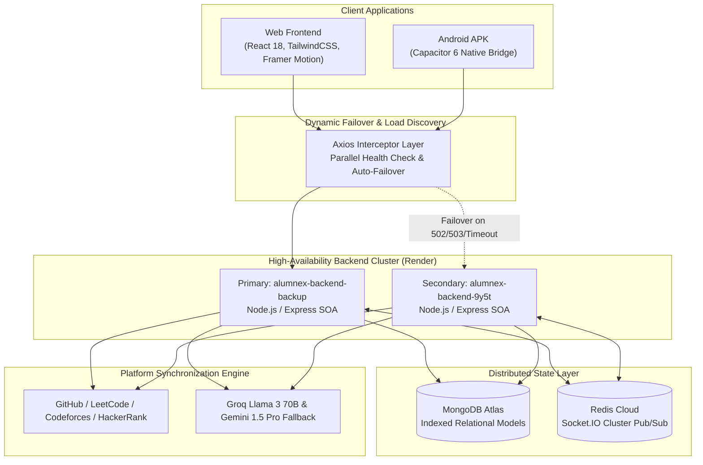

# Alumnex Connect

> **Integrated Mentorship, Career, and Developer Momentum Ecosystem**

[](https://github.com/SrimanKumarV/FSD/actions/workflows/test.yml)
[](https://github.com/SrimanKumarV/FSD/actions/workflows/build-apk.yml)
[](https://alumnex-connect.onrender.com)
[](https://github.com/SrimanKumarV/FSD/releases)
[](LICENSE)

---

## 📌 Executive Summary

**Alumnex Connect** transforms traditional university alumni directories into a continuous, production-grade professional ecosystem. It unifies bi-directional student-alumni mentorship, real-time messaging, multi-platform developer intelligence (GitHub, LeetCode, Codeforces), AI-assisted career progression, and an autonomous behavioral habit engine into a single responsive web and native Android application.

- **🌐 Live Production Application**: [https://alumnex-connect.onrender.com](https://alumnex-connect.onrender.com)
- **📱 Android APK Releases**: [GitHub Releases](https://github.com/SrimanKumarV/FSD/releases)
- **💻 Source Code**: [SrimanKumarV/FSD](https://github.com/SrimanKumarV/FSD)

---

## 🏛️ High-Level System Architecture



---

## 🚀 Core Product Capabilities

### 1. ⚡ Activity Hub & Behavioral Intelligence
- **Platform Ingestion**: Synchronizes and cryptographically verifies commits from **GitHub**, problem submissions from **LeetCode**, and contest results from **Codeforces** without manual intervention.
- **Trust Hierarchy**: Strictly segregates entries into `API_VERIFIED` (shield icon), `AUTO_DETECTED` (internal platform events), and `MANUAL` (self-reported) to prevent artificial gamification.
- **Consistency Index**: Mathematically computes habit durability (0–100) using Active Days (50%), Daily Goal Completion (30%), and Overall Streak Momentum (20%).
- **Personal Records**: Adaptive responsive metrics (Longest Streak, Total Verified Activities, Active Days, Peak Day, Top Source) styled to eliminate text clipping across all viewport widths.

### 2. 🎯 Personalized Dashboard & Next Best Action Engine
- **Deterministic Action Prioritization**: Above-the-fold intelligence module answering *"What should I pay attention to right now?"* based strictly on live user data:
  1. *Streak At Risk* (Highest urgency alert before midnight reset)
  2. *Uncompleted Daily Target* (Direct shortcut to incomplete goal)
  3. *Pending Mentorship Reviews* (Alumni guidance requests awaiting action)
  4. *Profile Incomplete* (Prompts for skills & bio to optimize AI pairing)
  5. *Role-Specific Career Step* (Vetted openings for students)

### 3. 🔍 DevPulse — Developer Analytics Engine
- Aggregate cross-platform developer portfolio aggregating GitHub repos and commits, LeetCode rating and topic breakdowns, and upcoming global competitive programming contests.
- Responsive container engineering with zero layout shifts, scoped Recharts containers, and touch-pan horizontal heatmap scrolling.

### 4. 🤝 Weighted Mentorship Matcher
- Autonomous auto-assignment algorithm scoring alumni mentors against students via:
  $$\text{Score} = (\text{College Match} \times 50) + (\text{Department Match} \times 25) + (\text{Skill Overlap} \times 10)$$
- Real-time 1:1 session scheduling, status tracking (`pending`, `accepted`, `completed`), and bi-directional review system.

### 5. 🤖 AI Career & Multi-Model Fallback
- Dual-provider LLM pipeline for deep resume analysis and skill gap extraction.
- Executes against **Groq Cloud (Llama-3.3-70b-versatile)** for sub-second execution with automated fallback to **Google Gemini 1.5 Pro** upon quota exhaustion or rate limiting.

### 6. 💬 Distributed Real-Time Messaging & Notifications
- Persistent chat rooms, read receipts, and user presence powered by **Socket.IO** scaled across multi-node servers via **Redis Pub/Sub adapter**.

---

## 🛠️ Technology Stack

| Layer | Technologies |
| :--- | :--- |
| **Frontend** | React 18, React Router v6, React Query, TailwindCSS, Framer Motion, Lucide Icons, Recharts |
| **Mobile** | Capacitor 6 Android Bridge, Native In-App Update Engine, Safe-Area Layouts |
| **Backend** | Node.js, Express.js (Service-Oriented Architecture), Socket.IO, Redis Client |
| **Database** | MongoDB Atlas, Mongoose ODM with compound indexing and cascade triggers |
| **AI / ML** | Groq Cloud SDK (Llama 3 70B), Google Generative AI (Gemini 1.5 Pro) |
| **Security** | Helmet, Double-Submit CSRF, express-mongo-sanitize, JWT, Cookie-Parser, Express Rate Limit |
| **CI / CD** | GitHub Actions, Gradle Android Build, Semantic Release Automation |

---

## 💻 Local Development Setup

### Prerequisites
- **Node.js**: v18.0+ or v20.0+
- **MongoDB**: Local Community Server or MongoDB Atlas URI
- **Redis** *(Optional for local dev)*: Local Redis or Redis Cloud free tier

### 1. Clone & Install

```bash
git clone https://github.com/SrimanKumarV/FSD.git
cd FSD/alumni-connect-website-main
```

### 2. Backend Setup

```bash
cd backend
npm install
```

Create a `.env` file in the `backend/` directory:

```env
PORT=5000
NODE_ENV=development
MONGODB_URI=mongodb+srv://<username>:<password>@cluster0.mongodb.net/alumnex
JWT_SECRET=your_super_secret_jwt_key
JWT_EXPIRE=7d
COOKIE_SECRET=your_cookie_encryption_secret

# AI Providers
GROQ_API_KEY=your_groq_api_key
GEMINI_API_KEY=your_gemini_api_key

# Optional Redis
REDIS_URL=redis://default:<password>@<host>:<port>

# Client Origin
CLIENT_URL=http://localhost:3000
```

Start the backend service:
```bash
npm run dev
```

### 3. Frontend Setup

```bash
cd ../frontend
npm install
```

Create a `.env` file in the `frontend/` directory:

```env
REACT_APP_API_URL=http://localhost:5000/api
REACT_APP_BACKUP_API_URL=https://alumnex-backend-9y5t.onrender.com/api
REACT_APP_GITHUB_CLIENT_ID=your_github_oauth_client_id
REACT_APP_GOOGLE_CLIENT_ID=your_google_oauth_client_id
```

Start the React development server:
```bash
npm start
```

### 4. Running Automated Tests

```bash
cd backend
npm test
```
*Current test suite: 56 passing tests covering RBAC, AuthService, JobService, MentorshipService, and CSRF protection.*

---

## 📱 Mobile APK Compilation

The Android mobile wrapper is synchronized with the React production bundle:

```bash
# 1. Build frontend
cd frontend
npm run build

# 2. Sync native Android project
cd ../mobile-wrapper
npm run sync:prod

# 3. Open in Android Studio or compile debug APK
npx cap open android
```

---

## 🔒 Security & Defense-in-Depth

- **Dual-Mode Token Resolution**: Transparently accepts HTTP-Only SameSite cookies (web browsers) or `Authorization: Bearer <token>` headers (Capacitor mobile client).
- **NoSQL Injection Neutralization**: `express-mongo-sanitize` strips reserved operators from all request payloads.
- **Strict Role-Based Access Control (RBAC)**: Validates granular permissions across `student`, `alumni`, `college`, and `admin` roles.
- **Failover Safe Guard**: Interceptors enforce bounded retry loops with exponential backoff to prevent DDoS amplification on cold-starting instances.

---

## 👥 Contributors

- **Sriman Kumar V** — Lead Full-Stack Architect & Engineering Lead ([GitHub](https://github.com/SrimanKumarV))

---

## 📄 License

This project is licensed under the [MIT License](LICENSE).
