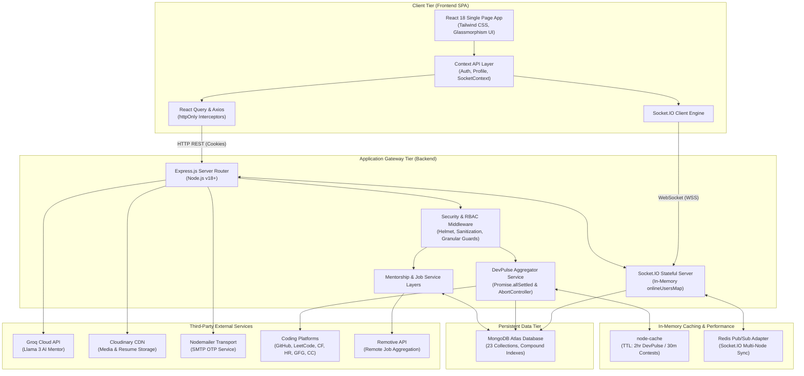
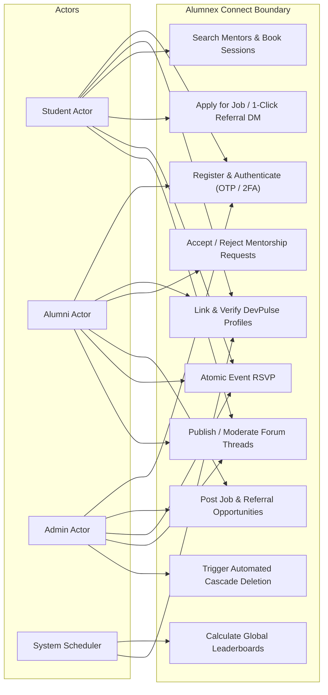
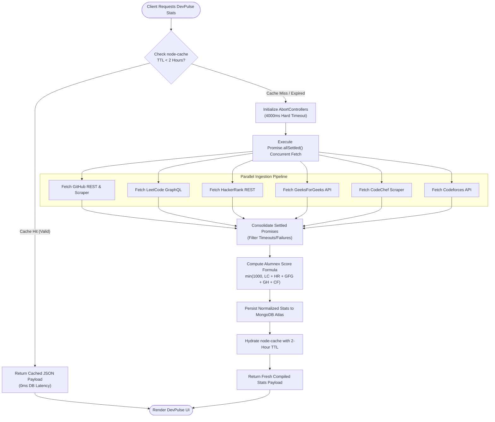
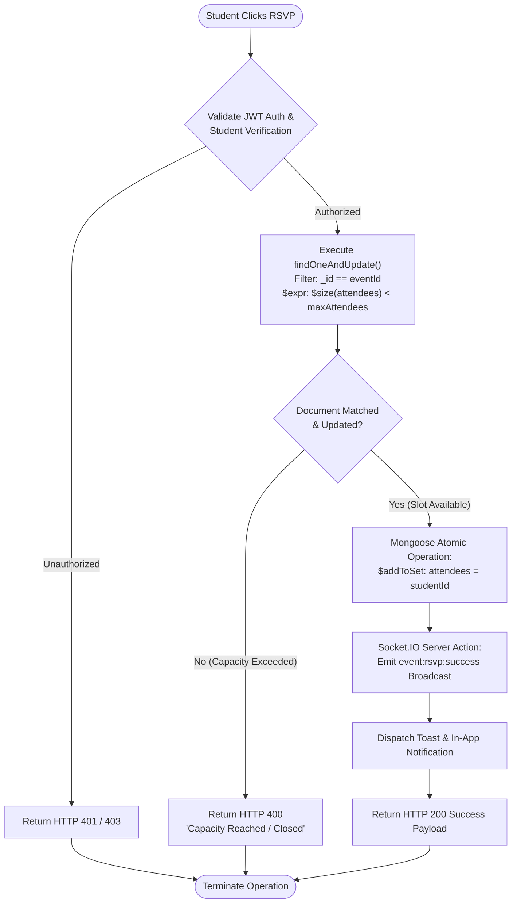
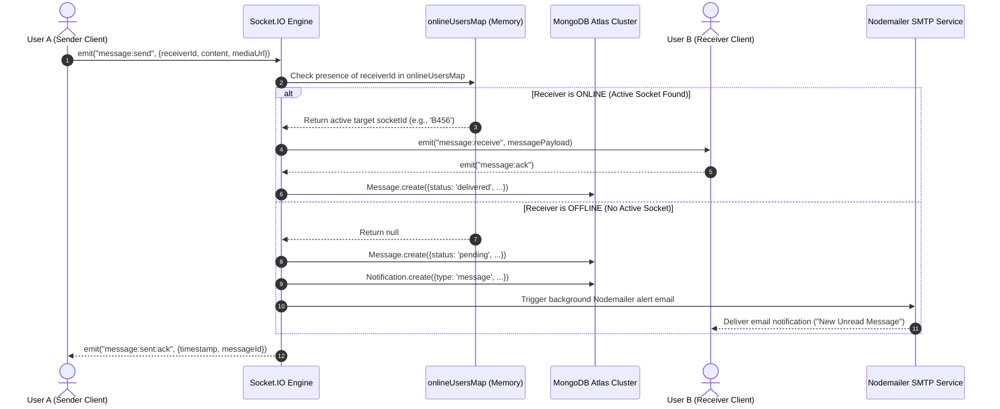
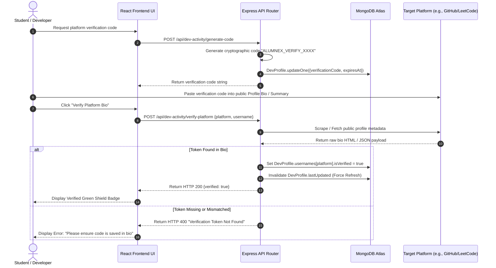
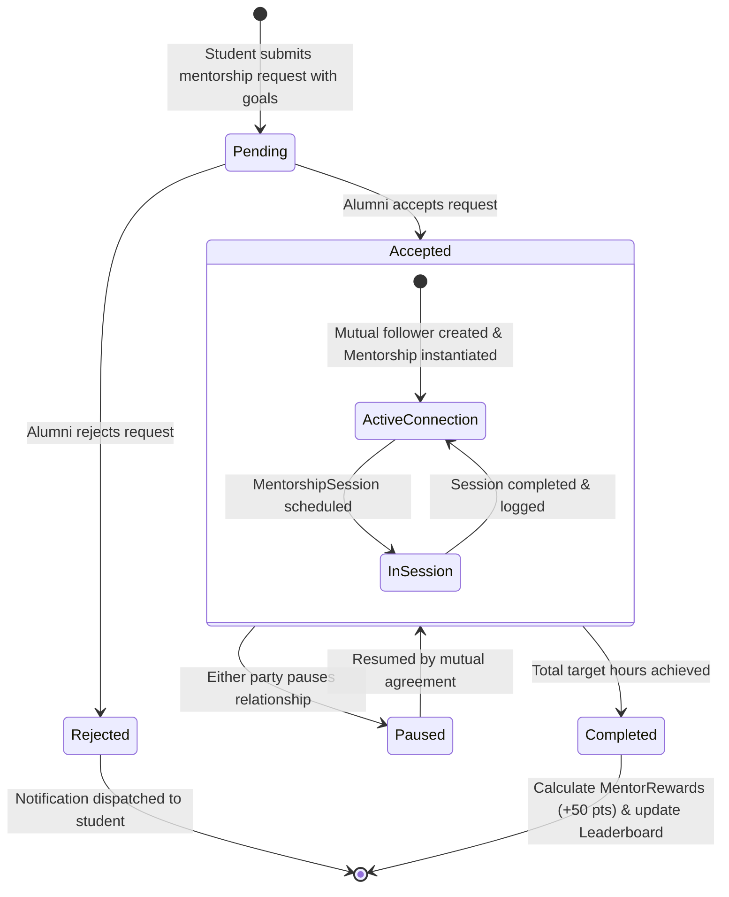
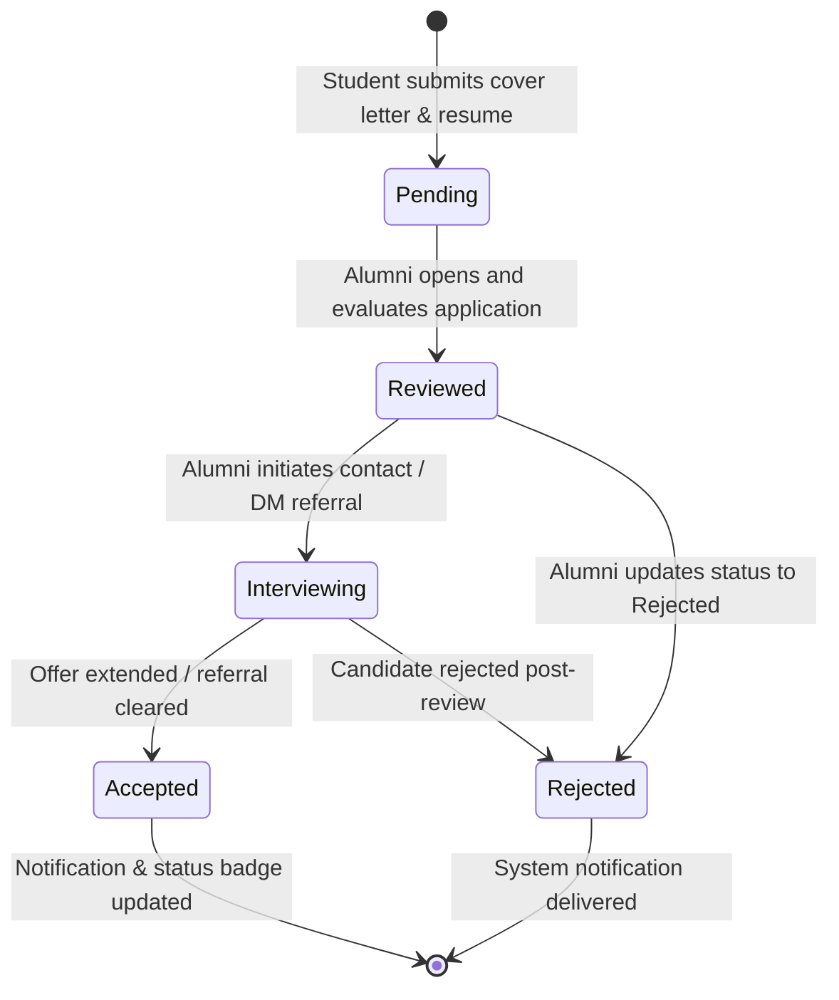
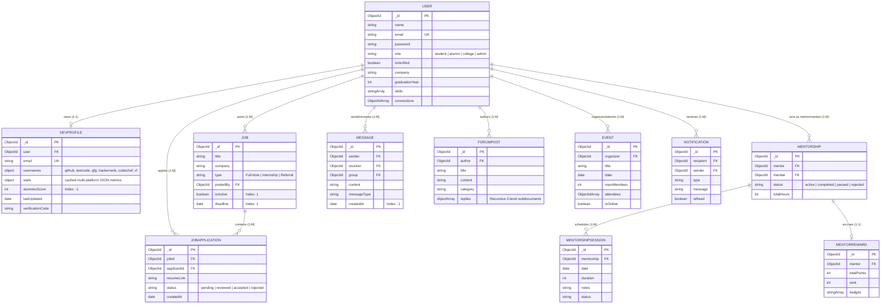
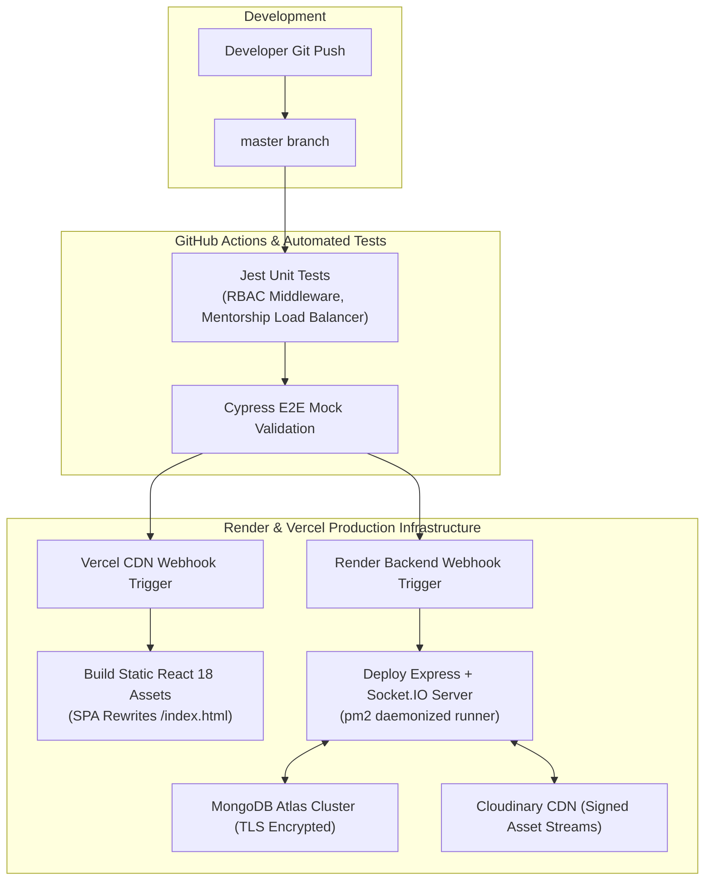

# Alumnex Connect: Unified Software Architecture & Agile SRS

## 1. Agile Project Charter & Requirements Matrix

### 1.1 Product Vision & Strategic Objectives
Alumnex Connect is an enterprise-grade networking and career acceleration ecosystem engineered to bridge the operational gap between current students, alumni, faculty, and institutional administrators. The system replaces broad, unverified professional networks with a verified, domain-specific community integrating real-time communication, automated AI career guidance, dynamic mentorship scheduling, and multi-platform developer benchmarking.

**Key Metrics & OKRs:**
- **Real-Time Communication Latency:** < 200 ms via persistent WebSocket dispatch.
- **Data Aggregation Speed:** Cached reads at 0 ms; API pipeline $\le$ 4000 ms via `Promise.allSettled()` with `AbortController` timeouts.
- **Concurrency & Integrity:** 0 Oversold Event Bookings enforced via atomic `$expr` conditional filters.
- **Security Standard:** 100% Stateless XSS-Immune Auth using `httpOnly` secure cookies and cryptographic OTPs.

### 1.2 Granular Role-Based Access Control (RBAC) Matrix
| Feature / Capability | Student | Alumni | College | Admin |
| :--- | :--- | :--- | :--- | :--- |
| **View Public Profiles** | Full | Full | Full | Full |
| **DevPulse Platform Linking** | Full | Full | Read-Only | Full |
| **Request Mentorship Session** | Full | Restricted | No | Audit Only |
| **Accept/Reject Mentees** | No | Full | No | Override |
| **Post Job / Internship** | No | Full | Full | Full |
| **Request Referral via DM** | Full | Full | No | No |
| **Create Campus Events** | No | Full | Full | Full |
| **Event RSVP Reservation** | Full | Full | Full | Full |
| **Forum Thread Creation** | Full | Full | Full | Full |
| **Global Moderation / Ban** | No | No | Departmental | Full System |

### 1.3 Product Backlog & Agile User Stories

#### Epic 1: Identity, Omni-Channel 2FA & Granular Access Control
**US-01: Omni-Channel Two-Factor Registration**
*Story Points: 5 | Priority: MUST*
```gherkin
Scenario: Successful student registration with secure OTP delivery
  Given a student inputs valid email, password, and department details
  When the submission is processed via POST /api/auth/register
  Then a User document is created with isVerified: false
  And an encrypted 6-digit OTP is delivered via SMTP Nodemailer within 30 seconds
  And the client is directed to the OTP validation screen
```

**US-02: Strict Cookie-Based Stateless Authentication**
*Story Points: 3 | Priority: MUST*
```gherkin
Scenario: User login with httpOnly cookie dispatch
  Given a registered user enters valid credentials
  When POST /api/auth/login validates the Bcrypt hash
  Then the server returns an httpOnly secure JWT token cookie
  And the client state is hydrated with profile data without exposing JWT to JavaScript
```

#### Epic 2: Real-Time Event-Driven WebSocket Engine & Messaging
**US-03: Stateful Direct Messaging with Database Fallback**
*Story Points: 8 | Priority: MUST*
```gherkin
Scenario: Real-time message exchange between active users
  Given User A is connected with socketId mapped in onlineUsersMap
  When User A emits message:send targeted to User B
  Then Socket.IO routes the payload to User B's active socket instantly
  And the message document is asynchronously committed to MongoDB Atlas
```

**US-04: Offline Push Fallback Notification**
*Story Points: 5 | Priority: SHOULD*
```gherkin
Scenario: Message dispatch to an offline receiver
  Given User B is not present in onlineUsersMap
  When User A emits message:send to User B
  Then the backend persists the message document
  And dispatches a real-time Notification document alongside an asynchronous SMTP email alert
```

#### Epic 3: DevPulse Multi-Platform Ingestion, Timeout Resilience & Algorithmic Scoring
**US-05: Parallel Scraper Pipeline with Non-Blocking Timeouts**
*Story Points: 8 | Priority: MUST*
```gherkin
Scenario: Fetching multi-platform developer metrics
  Given a user requests GET /api/dev-activity/:email
  When node-cache encounters a cache miss
  Then concurrent fetch requests are dispatched across GitHub, LeetCode, HackerRank, GFG, CodeChef, and Codeforces
  And each request is guarded by an AbortController with a 4000ms hard ceiling
```

**US-06: Bio-Verification Code Validation**
*Story Points: 5 | Priority: MUST*
```gherkin
Scenario: Verifying platform account ownership
  Given a user generates token ALUMNEX_VERIFY_XXXXXXXX
  When the user pastes the token into their external platform bio and triggers verification
  Then the backend scraper confirms the token's presence in raw HTML/API payloads
  And sets DevProfile.usernames[platform].isVerified = true
```

#### Epic 4: Mentorship Lifecycle, Dynamic Booking & Gamified Rewards
**US-07: Structured Mentorship Workflow**
*Story Points: 5 | Priority: MUST*
```gherkin
Scenario: Mentorship request acceptance lifecycle
  Given a student initiates a request with goals to an alumnus
  When the alumnus accepts via PUT /api/mentorship/request/:id/respond
  Then a Mentorship document is instantiated with status: 'active'
  And an automatic mutual follower relationship is committed to the database
```

**US-08: MentorReward Leaderboard Accrual**
*Story Points: 5 | Priority: COULD*
```gherkin
Scenario: Session logging and point allocation
  Given an active Mentorship session reaches completed status
  When the alumnus logs session hours in MentorshipSession
  Then MentorReward.totalPoints increases by +50
  And the alumnus's ranking updates across the global mentor leaderboard
```

#### Epic 5: Career Opportunities, Instant Referral Pings & Nested Forums
**US-09: Real-Time Job Broadcast & 1-Click Referral DM**
*Story Points: 5 | Priority: MUST*
```gherkin
Scenario: Student requests an instant job referral
  Given a student views an active referral opportunity
  When the student clicks "Request Referral"
  Then an automated direct message payload containing resume links is delivered to the posting alumnus
  And an application record is created with status: 'pending'
```

**US-10: Recursive Forum Hierarchy with Author Safeguards**
*Story Points: 5 | Priority: MUST*
```gherkin
Scenario: Nested thread replies and deletion bounds
  Given an authenticated user views a forum post
  When the user posts a reply up to 2 sub-document levels deep
  Then the thread array updates in a single atomic document write
  And only the verified author or admin can trigger deletion operations
```

#### Epic 6: Atomic Concurrency Controls & Global Event Management
**US-11: Atomic Capacity Guard for Event Registrations**
*Story Points: 5 | Priority: MUST*
```gherkin
Scenario: High-concurrency event RSVP
  Given an event has a strict maximum capacity
  When multiple concurrent requests invoke POST /api/events/:id/rsvp
  Then MongoDB processes updates using $expr: { $lt: [{ $size: "$attendees" }, "$maxAttendees"] }
  And all requests beyond the limit return HTTP 400 without overselling seats
```

---

## 2. Complete Visual System Specifications

### 2.1 C4 Level 2: System Architecture Diagram


### 2.2 Comprehensive Use Case Diagram


### 2.3 Activity Diagram 1: DevPulse Parallel Aggregation Pipeline


### 2.4 Activity Diagram 2: Atomic RSVP Concurrency Gate


### 2.5 Sequence Diagram 1: Stateful Direct Messaging & Offline Fallback


### 2.6 Sequence Diagram 2: DevPulse Bi-Directional Platform Verification


### 2.7 State Machine Diagram 1: Mentorship Lifecycle


### 2.8 State Machine Diagram 2: Job Application Lifecycle


### 2.9 Unified Entity-Relationship Diagram (UML ERD)


---

## 3. Data Dictionary, IndexING Strategy & REST API Reference

### 3.1 Comprehensive Data Dictionary

**User Schema Model**
| Field Name | BSON Type | Constraints & Validation | Description |
| :--- | :--- | :--- | :--- |
| `_id` | ObjectId | Primary Key, Auto-generated | Unique record identifier. |
| `name` | String | Required, trim: true, length $\ge$ 2 | Full legal name. |
| `email` | String | Required, Unique, Email Regex | Verification and login identity. |
| `password` | String | Required, Bcrypt Hash (Cost: 12) | Excluded from queries by default (select: false). |
| `role` | String | Enum: ['student', 'alumni', 'college', 'admin'] | RBAC authorization driver. |
| `isVerified` | Boolean | Default: false | Controlled by SMTP OTP validation. |
| `isApproved` | Boolean | Default: false for college/alumni | Admin moderation flag. |
| `connections` | Array[ObjectId] | Ref: User model | Direct bi-directional network links. |

**DevProfile Schema Model**
| Field Name | BSON Type | Constraints & Validation | Description |
| :--- | :--- | :--- | :--- |
| `_id` | ObjectId | Primary Key, Auto-generated | Record identifier. |
| `user` | ObjectId | Required, Unique, Ref: User (1:1) | Linked user identity. |
| `usernames` | Object | Strict nested structure | Handles for GitHub, LeetCode, HackerRank, GFG, CodeChef, CF. |
| `stats` | Object | Mixed sub-document | Aggregated metrics, rankings, and badge URLs. |
| `alumnexScore` | Number | Min: 0, Max: 1000 | Weighted developer score. |
| `lastUpdated` | Date | Timestamp format | Cache TTL tracking boundary (2 Hours). |

**Job & JobApplication Schema Models**
| Field Name | BSON Type | Constraints & Validation | Description |
| :--- | :--- | :--- | :--- |
| `jobId` | ObjectId | Ref: Job, Required | Target position. |
| `applicantId` | ObjectId | Ref: User, Required | Applying student. |
| `resumeLink` | String | Required, HTTPS URL validation | Cloudinary hosted PDF asset. |
| `status` | String | Enum: ['pending', 'reviewed', 'accepted', 'rejected'] | Current application lifecycle state. |

### 3.2 Production Indexing Strategy
| Target Schema | Compound Index Definition | Optimization Justification |
| :--- | :--- | :--- |
| **User** | `{ email: 1, isVerified: 1 }` | Eliminates collection scans for high-frequency login routes. |
| **Message** | `{ sender: 1, receiver: 1, createdAt: -1 }` | Accelerates reverse-chronologic chat pagination queries. |
| **Job** | `{ postedBy: 1, isActive: 1 }` | Facilitates instantaneous active opportunity listings. |
| **DevProfile** | `{ alumnexScore: -1, user: 1 }` | Supports index-covered global leaderboard generation. |
| **Event** | `{ isActive: 1, deadline: 1 }` | Filters expired events without scanning past documents. |
| **JobApplication** | `{ jobId: 1, applicantId: 1 }` (UNIQUE) | Unique index preventing double application submissions. |

### 3.3 Comprehensive REST API Reference Catalog
| Method | Path | Auth Guard | Operational Target |
| :--- | :--- | :--- | :--- |
| **POST** | `/api/auth/register` | Public | Hash pass & trigger OTP email. |
| **POST** | `/api/auth/verify-otp` | Public | Validate OTP, set verified state. |
| **POST** | `/api/auth/login` | Strict RateLimit (10 req/15m) | Validate hash, issue cookie JWT. |
| **GET** | `/api/users/:id` | JWT Authenticated | Fetch user profile & network graph. |
| **POST** | `/api/users/:id/follow` | JWT Authenticated | Toggle mutual network connections. |
| **GET** | `/api/jobs` | JWT Authenticated | Merged DB + Remotive API listings (Max 50). |
| **POST** | `/api/jobs` | RBAC: Alumni / College / Admin | Post job, emit 'job:new' Socket. |
| **POST** | `/api/jobs/:id/apply` | RBAC: Student | Submit PDF link & cover letter. |
| **GET** | `/api/dev-activity/:email` | JWT Authenticated | Multi-platform 2hr cached metrics. |
| **POST** | `/api/dev-activity/verify` | JWT Authenticated | Scrape platform bio for token validation. |
| **POST** | `/api/mentorship/request` | RBAC: Student | Dispatch session request & notif. |
| **PUT** | `/api/mentorship/respond/:id`| RBAC: Alumni | Accept/Reject request state machine. |
| **POST** | `/api/events/:id/rsvp` | JWT Authenticated | Atomic `$expr` capacity-guarded reservation. |
| **GET** | `/api/leaderboard` | JWT Authenticated | High-speed sorted DevScore output. |
| **POST** | `/api/ai/chat` | JWT Authenticated | Groq Llama 3 career assistant proxy. |

---

## 4. Security Matrix, Defensive Architecture & DevOps Blueprint

### 4.1 Defensive Security Hardening Suite
| Threat Vector | Mitigation Implementation Standard |
| :--- | :--- |
| **Cross-Site Scripting (XSS)** | Pure stateless `httpOnly` cookies for JWTs. JavaScript cannot access `document.cookie`. Strict CSP via Helmet. |
| **NoSQL Injection Attacks** | Sanitization via `express-mongo-sanitize` stripping `$` and `.` characters from incoming request payloads. |
| **HTTP Parameter Pollution**| `hpp` middleware protection against array parameter bugs. |
| **Brute-Force / Enumeration**| Dual-tier `express-rate-limit`: Global API limit + strict 10 requests / 15-minute limiter on `/api/auth/*`. |
| **Cross-Origin Exploits** | Explicit CORS allowlisting with credentials support (`origin: process.env.FRONTEND_URL`, `credentials: true`). |

### 4.2 Data Integrity: Cascading Deletion Hooks
To eliminate orphaned subdocuments when a user exercises their right to account deletion, the Mongoose User schema registers a pre-hook middleware:
```javascript
// backend/models/User.js - Cascade Deletion Hook
UserSchema.pre('deleteOne', { document: true, query: false }, async function(next) {
  const userId = this._id;
  await Promise.all([
    mongoose.model('DevProfile').deleteOne({ user: userId }),
    mongoose.model('JobApplication').deleteMany({ applicantId: userId }),
    mongoose.model('Mentorship').deleteMany({ $or: [{ mentor: userId }, { mentee: userId }] }),
    mongoose.model('ForumPost').deleteMany({ author: userId }),
    mongoose.model('Message').deleteMany({ $or: [{ sender: userId }, { receiver: userId }] }),
    mongoose.model('Notification').deleteMany({ $or: [{ recipient: userId }, { sender: userId }] })
  ]);
  next();
});
```

### 4.3 Production CI/CD Deployment Architecture


### 4.4 Automated Keep-Alive & Client Failover Pattern
- **Frontend Dynamic URL Resolution:** Client API instances monitor latency bounds; if requests to the primary Render backend time out (>10s on cold start), Axios intercepts the 504 and routes non-mutating reads to a mirror fallback gateway.
- **Scheduled Keep-Awake Self-Ping:** Render web services run a cron daemon triggering a lightweight endpoint (`GET /`) every 14 minutes, preventing node runtime deactivation during standard operation.
