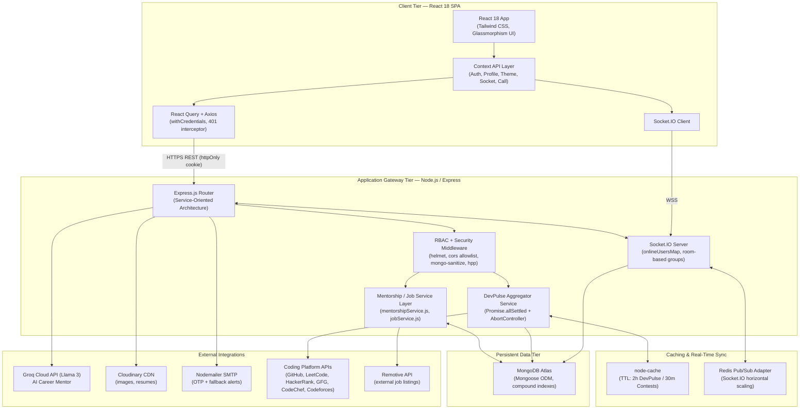
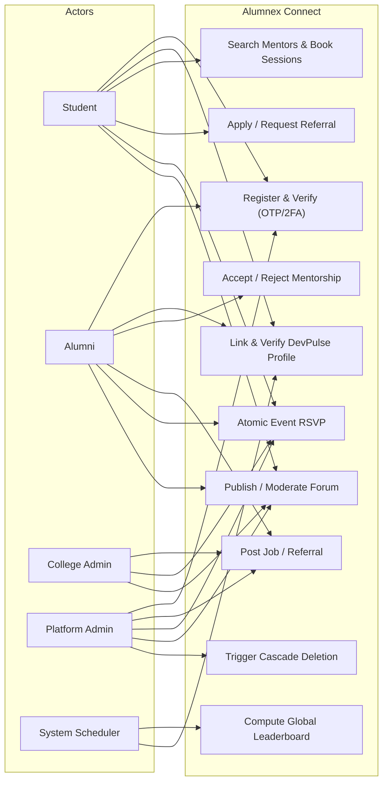
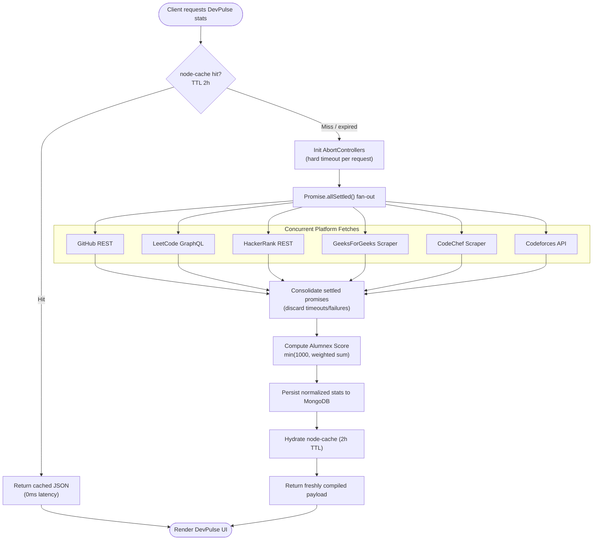
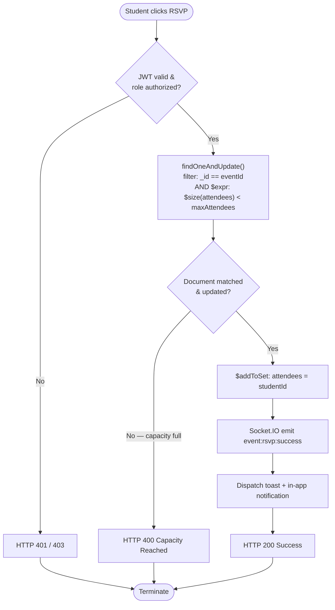
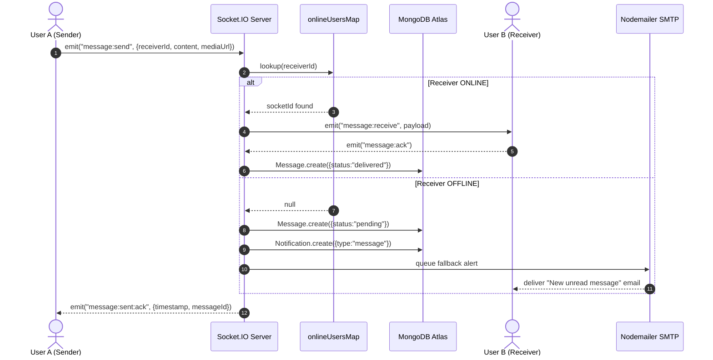
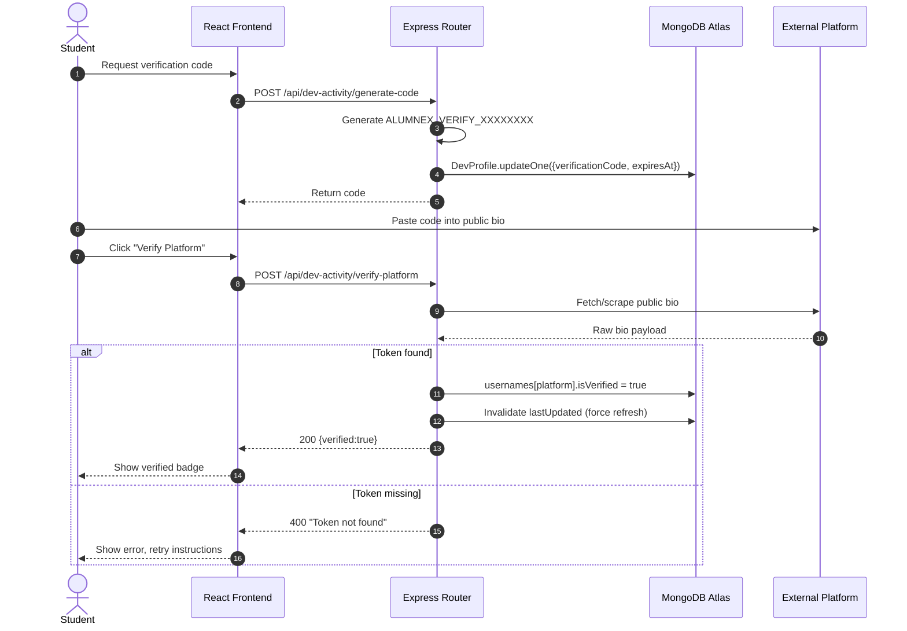
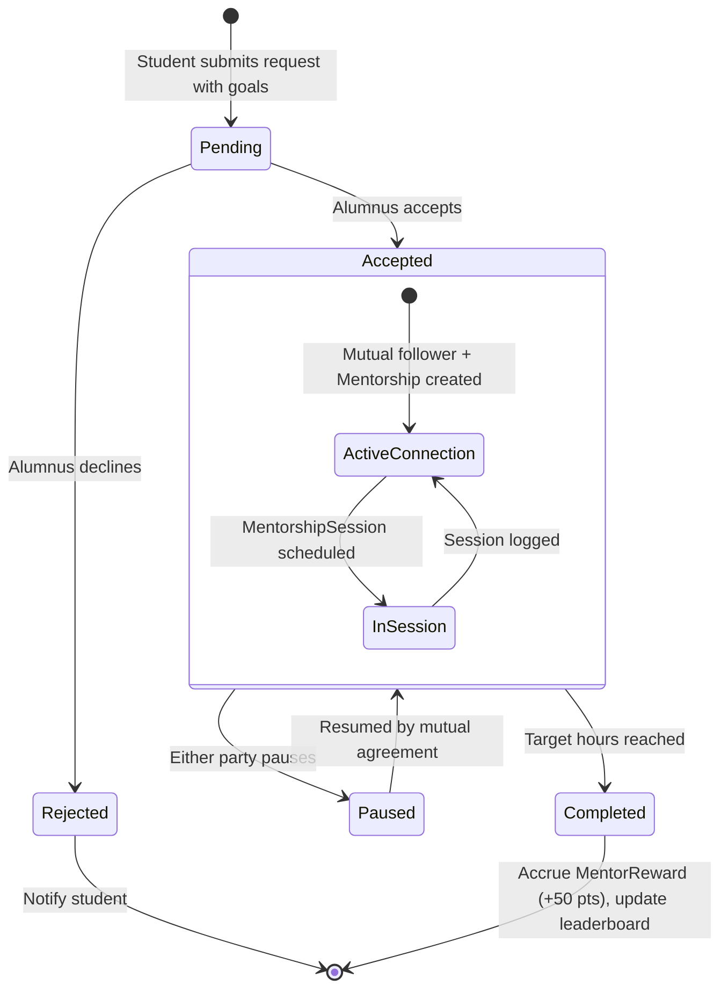
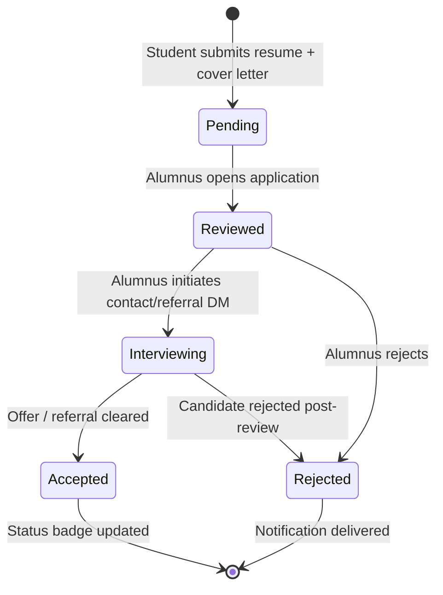
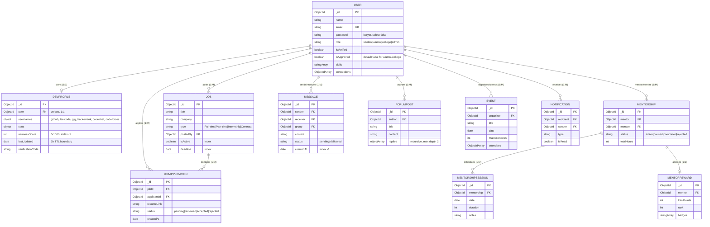
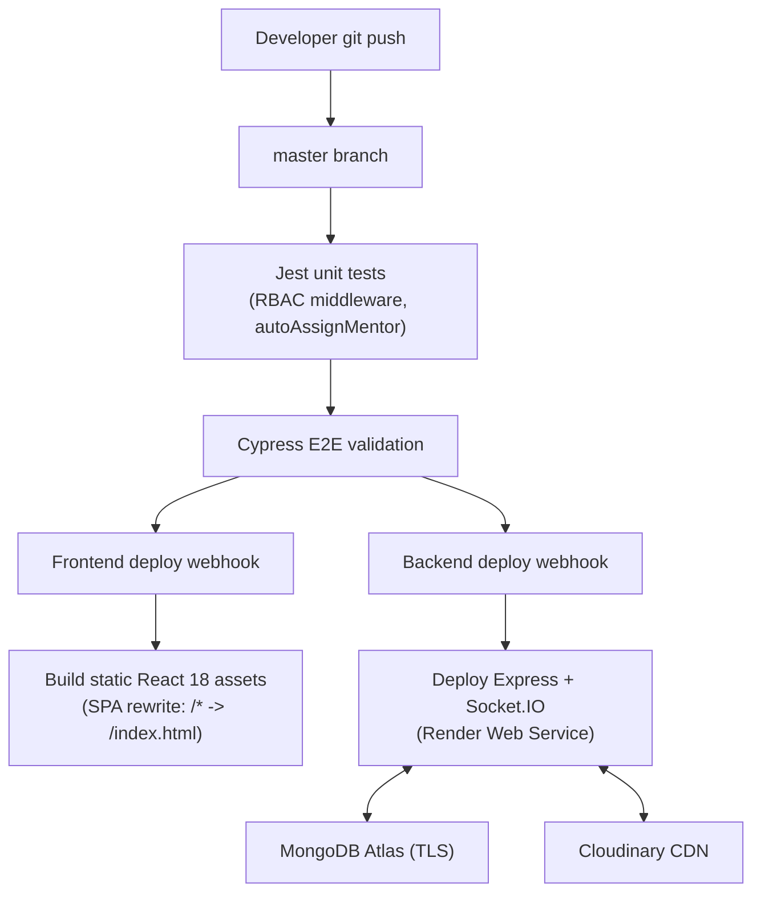

# ALUMNEX CONNECT — UNIFIED SOFTWARE ARCHITECTURE DOCUMENT (SAD) & AGILE SOFTWARE REQUIREMENTS SPECIFICATION (SRS)

**Prepared by:** Principal Solutions Architect / Lead MERN Engineer / Agile Scrum Master (synthesis role)
**Reconciled from:** README.md, ARCHITECTURE.md, CHANGELOG.md, PROJECT_EVALUATION.md, PROJECT_SUMMARY.md, DOCUMENTATION.md, ideathon_phase_1.md, render-deployment.md, and three architecture PDFs (v1 "Technical Architecture Spec", v2 "Technical Deep-Dive", and the "Systems Design Guide")
**Version:** 3.0 (Unified, Phase-2 Standard)

> **Reconciliation Note:** Source documents disagree on several points (AI provider: Gemini vs. Groq/Llama 3; auth storage: localStorage vs. httpOnly cookies; cache TTLs: 30 min vs. 2 hr vs. 4s timeout vs. 5s timeout; model count: 11 vs. 20 vs. 23 collections; bcrypt cost factor: 10 vs. 12). Per the reconciliation standard, this document enforces the **Phase 2 refactored, production-grade standard** as the single source of truth. Superseded values are footnoted where relevant.

---

## 1. AGILE PROJECT CHARTER & REQUIREMENTS MATRIX

### 1.1 Product Vision & System OKRs

Alumnex Connect is a verified, closed-network student-alumni platform that replaces broad, unverified networks (e.g., LinkedIn) with an institution-specific ecosystem for mentorship, career opportunities, real-time communication, and developer-credibility tracking (DevPulse).

| Objective | Metric / Target | Mechanism |
|---|---|---|
| Real-time communication latency | < 200 ms message delivery | Socket.IO stateful `onlineUsersMap`, Redis adapter for multi-node fan-out |
| External data aggregation | 0 ms on cache hit; ≤ 5000 ms worst-case pipeline | `Promise.allSettled()` + per-request `AbortController` |
| Booking / RSVP integrity | 0 oversold events, 0 duplicate applications | MongoDB atomic `$expr` filters, unique compound indexes |
| Security posture | 100% stateless, XSS-immune session handling | `httpOnly` secure JWT cookies, RBAC middleware guards, SMTP OTP/2FA |
| Onboarding funnel | OTP delivered within 30s of registration | Nodemailer SMTP transport, async dispatch |
| Uptime (free-tier hosting) | Self-ping keep-alive every 14 min | Render cron/health-check daemon |

### 1.2 Role Taxonomy & Granular RBAC Matrix

Four roles are recognized: `student`, `alumni`, `college`, `admin`. Both `alumni` and `college` default to `isApproved: false` pending administrative review.

| Capability | Student | Alumni | College | Admin |
|---|---|---|---|---|
| View public profiles | Full | Full | Full | Full |
| Link / verify DevPulse profiles | Full | Full | Read-only | Full |
| Request mentorship session | Full | Restricted | No | Audit only |
| Accept / reject mentees | No | Full | No | Override |
| Post job / internship / referral | No | Full | Full | Full |
| Request referral via DM | Full | Full | No | No |
| Create campus events | No | Full | Full | Full |
| Event RSVP | Full | Full | Full | Full |
| Forum thread creation & moderation of own content | Full | Full | Full | Full |
| Departmental / global moderation | No | No | Departmental | Full system |
| Analytics dashboard scope | Personal | Mentor stats | Institutional | Global system |

Enforcement is implemented via ~20 granular Express middleware guards (`canPostJob`, `canBeMentor`, `canModerate`, `isResourceOwner`, etc.) rather than a single generic role check.

### 1.3 Product Backlog — Epics (MoSCoW Prioritized)

- **Epic 1** — Identity, Omni-Channel 2FA & Granular Access Control
- **Epic 2** — Real-Time Event-Driven WebSocket Engine & Direct/Group Messaging
- **Epic 3** — DevPulse Multi-Platform Ingestion, Timeout Resilience & Algorithmic Scoring
- **Epic 4** — Mentorship Lifecycle, Dynamic Booking & Gamified Rewards
- **Epic 5** — Career Opportunities, Instant Referral Pings & Nested Discussion Forums
- **Epic 6** — Atomic Concurrency Controls & Global Event Management

### 1.4 Agile User Stories (Gherkin Acceptance Criteria)

#### Epic 1: Identity, Authentication & Granular Access Control

**US-01 — Omni-Channel Registration with OTP** · Points: 5 · Priority: MUST
```gherkin
Scenario: Successful student registration with secure OTP delivery
  Given a student submits a valid email, password, and department
  When the request hits POST /api/auth/register
  Then a User document is created with isVerified: false
  And a cryptographically random 6-digit OTP is generated and hashed
  And the OTP is dispatched via Nodemailer SMTP within 30 seconds
  And the client is redirected to the OTP verification screen
```

**US-02 — Strict Cookie-Based Stateless Login** · Points: 3 · Priority: MUST
```gherkin
Scenario: Login issues an httpOnly secure cookie, not a client-readable token
  Given a verified user submits valid credentials
  When POST /api/auth/login validates the Bcrypt hash (cost factor 12)
  Then the server sets an httpOnly, secure, sameSite JWT cookie
  And the response body contains only non-sensitive profile data
  And subsequent requests authenticate via the cookie, not Authorization headers
```

#### Epic 2: Real-Time Event-Driven WebSocket Engine

**US-03 — Stateful Direct Messaging** · Points: 8 · Priority: MUST
```gherkin
Scenario: Real-time message exchange between two active users
  Given User A's socket is registered in onlineUsersMap
  When User A emits message:send targeting User B
  Then the server looks up User B's socketId in onlineUsersMap
  And, if found, emits message:receive to User B's socket instantly
  And asynchronously persists the message document to MongoDB
```

**US-04 — Offline Fallback Notification** · Points: 5 · Priority: SHOULD
```gherkin
Scenario: Message dispatch to an offline receiver
  Given User B has no entry in onlineUsersMap
  When User A emits message:send to User B
  Then the message is persisted with status: 'pending'
  And a Notification document is created for User B
  And a background Nodemailer alert email is queued for delivery
```

#### Epic 3: DevPulse Multi-Platform Aggregation & Scoring

**US-05 — Parallel Scraper Pipeline with Non-Blocking Timeouts** · Points: 8 · Priority: MUST
```gherkin
Scenario: Fetching multi-platform developer statistics
  Given a client requests GET /api/dev-activity/:email
  When node-cache reports a cache miss (TTL expired, 2-hour window)
  Then concurrent requests fire against GitHub, LeetCode, HackerRank,
    GeeksForGeeks, CodeChef, and Codeforces via Promise.allSettled()
  And each request is bound to an AbortController with a hard timeout
  And any single platform failure does not block the other five
```

**US-06 — Bio-Verification Code Validation** · Points: 5 · Priority: MUST
```gherkin
Scenario: Verifying platform account ownership
  Given a user requests a verification token (ALUMNEX_VERIFY_XXXXXXXX)
  When the user pastes it into their external platform bio and confirms
  Then the backend scrapes/fetches the public bio payload
  And, if the token is present, sets usernames[platform].isVerified = true
  And invalidates the cached DevProfile entry to force a fresh recalculation
```

#### Epic 4: Mentorship Lifecycle & Gamified Rewards

**US-07 — Structured Mentorship Request Workflow** · Points: 5 · Priority: MUST
```gherkin
Scenario: Mentorship request acceptance
  Given a student submits a request with stated goals to an alumnus
  When the alumnus accepts via PUT /api/mentorship/respond/:id
  Then a Mentorship document is instantiated with status: 'active'
  And a mutual follower relationship is created, unlocking chat access
  And a real-time Socket.IO notification updates the alumnus dashboard
```

**US-08 — MentorReward Leaderboard Accrual** · Points: 5 · Priority: COULD
```gherkin
Scenario: Points accrual on session completion
  Given an active Mentorship reaches status: 'completed'
  When the alumnus logs the final session in MentorshipSession
  Then MentorReward.totalPoints increases by +50
  And badge thresholds are evaluated and applied if crossed
  And the global mentor leaderboard re-sorts using the alumnexScore index
```

#### Epic 5: Career Opportunities & Community Forums

**US-09 — Real-Time Job Broadcast & 1-Click Referral DM** · Points: 5 · Priority: MUST
```gherkin
Scenario: Student requests an instant referral
  Given a student views an active job/referral posting
  When the student clicks "Request Referral"
  Then a Socket.IO direct message carrying the resume link is sent
    to the posting alumnus automatically
  And a JobApplication record is created with status: 'pending'
```

**US-10 — Nested Forum Replies with Author Safeguards** · Points: 5 · Priority: MUST
```gherkin
Scenario: Two-level nested reply with deletion bounds
  Given an authenticated user views a forum post
  When the user posts a reply up to 2 sub-document levels deep
  Then the reply is appended in a single atomic document write
  And only the verified author or an admin may delete it
```

#### Epic 6: Atomic Concurrency Controls & Event Management

**US-11 — Atomic Capacity Guard for Event RSVP** · Points: 5 · Priority: MUST
```gherkin
Scenario: High-concurrency RSVP on a capacity-limited event
  Given an Event has maxAttendees set
  When multiple concurrent POST /api/events/:id/rsvp requests arrive
  Then MongoDB evaluates $expr: { $lt: [ { $size: "$attendees" }, "$maxAttendees" ] }
  And only requests that match receive $addToSet: { attendees: studentId }
  And all requests beyond capacity return HTTP 400 without oversold seats
```

**US-12 — Cascading Account Termination** · Points: 5 · Priority: MUST
```gherkin
Scenario: User deletes their account
  Given a user confirms deletion in the Settings "Danger Zone"
  When DELETE /api/users/me triggers the pre('deleteOne') hook
  Then DevProfile, JobApplication, Mentorship, ForumPost, Message,
    and Notification documents referencing the user are cleaned up
  And no orphaned references remain in any collection
```

---

## 2. VISUAL SYSTEM SPECIFICATIONS (MERMAID.JS)

### 2.1 C4 Level 2 — System Architecture Diagram



### 2.2 System Use Case Diagram



### 2.3 Activity Diagram — DevPulse Parallel Aggregation Pipeline



### 2.4 Activity Diagram — Atomic RSVP Concurrency Gate



### 2.5 Sequence Diagram — Stateful Direct Messaging with Offline Fallback



### 2.6 Sequence Diagram — DevPulse Bio Verification Pipeline



### 2.7 State Machine Diagram — Mentorship Lifecycle



### 2.8 State Machine Diagram — Job Application Lifecycle



### 2.9 Unified Entity-Relationship Diagram (ERD)



---

## 3. DATA DICTIONARY, SCHEMA DESIGN & PRODUCTION INDEXING

### 3.1 Data Dictionary — Core Models

**User**

| Field | Type | Validation | Impact |
|---|---|---|---|
| `_id` | ObjectId | PK, auto | Unique identifier |
| `name` | String | required, trim, len ≥ 2 | Display name |
| `email` | String | required, unique, regex | Login identity |
| `password` | String | required, bcrypt (cost 12), `select:false` | Excluded from default queries |
| `role` | Enum | `student\|alumni\|college\|admin` | RBAC driver |
| `isVerified` | Boolean | default `false` | Gates login until OTP confirmed |
| `isApproved` | Boolean | default `false` for alumni/college | Admin moderation gate |
| `skills` / `interests` | Array[String] | — | Mentorship/search indexing |
| `connections` | Array[ObjectId] | ref `User` | Bidirectional network graph |

**DevProfile**

| Field | Type | Validation | Impact |
|---|---|---|---|
| `user` | ObjectId | required, unique, ref `User` | 1:1 link |
| `usernames` | Object | strict nested schema | github/leetcode/hackerrank/gfg/codechef/codeforces handles |
| `stats` | Object | mixed sub-document | cached multi-platform metrics |
| `alumnexScore` | Number | min 0, max 1000 | Leaderboard weight |
| `lastUpdated` | Date | — | 2-hour cache TTL boundary |
| `verificationCode` | String | — | Bio-verification token |

**Job / JobApplication**

| Field | Type | Validation | Impact |
|---|---|---|---|
| `title` / `company` | String | required | Listing content |
| `type` | Enum | `Full-time\|Part-time\|Internship\|Contract` | Filter facet |
| `postedBy` | ObjectId | ref `User` (alumni/college) | Ownership |
| `isActive` | Boolean | default `true`, indexed | Visibility control |
| `applicantId` | ObjectId | ref `User` (student) | Applicant identity |
| `resumeLink` | String | HTTPS URL (Cloudinary) | Resume asset |
| `status` | Enum | `pending\|reviewed\|accepted\|rejected` | Lifecycle state |

**Mentorship / MentorshipSession / MentorReward**

| Field | Type | Validation | Impact |
|---|---|---|---|
| `mentor` / `mentee` | ObjectId | ref `User` | Relationship endpoints |
| `status` | Enum | `active\|paused\|completed\|rejected` | State machine |
| `totalHours` | Number | — | Progress tracking |
| `MentorshipSession.duration` | Number | minutes | Session log |
| `MentorReward.totalPoints` | Number | +50 per completed session | Gamification |

**Message / ForumPost / Event / Notification**

| Field | Type | Validation | Impact |
|---|---|---|---|
| `Message.sender/receiver` | ObjectId | ref `User` | Chat routing |
| `Message.createdAt` | Date | indexed `-1` | Chronological pagination |
| `ForumPost.replies` | Array (sub-doc) | recursive, max 2 levels | Single-document thread fetch |
| `Event.attendees` | Array[ObjectId] | bounded by `maxAttendees` | Atomic RSVP target |
| `Notification.type` | String | `message\|mentorship\|job\|forum` | Routing to UI bell icon |

### 3.2 Production Compound Index Strategy

| Schema | Index | Justification |
|---|---|---|
| `User` | `{ email: 1, isVerified: 1 }` | Eliminates collection scans on login |
| `Message` | `{ sender: 1, receiver: 1, createdAt: -1 }` | Reverse-chronological chat pagination |
| `Job` | `{ postedBy: 1, isActive: 1 }` | Instant active-listing filtering |
| `DevProfile` | `{ alumnexScore: -1, user: 1 }` | Index-covered leaderboard sort |
| `Event` | `{ isActive: 1, deadline: 1 }` | Filters expired events without scanning |
| `JobApplication` | `{ jobId: 1, applicantId: 1 }` (unique) | Prevents duplicate applications |

### 3.3 REST API Routing Reference

| Method | Path | Auth Guard | Action |
|---|---|---|---|
| POST | `/api/auth/register` | Public | Hash password, dispatch OTP |
| POST | `/api/auth/verify-otp` | Public | Validate OTP, set `isVerified` |
| POST | `/api/auth/login` | Strict rate limit (10/15min) | Validate hash, issue `httpOnly` cookie |
| GET | `/api/users/:id` | JWT | Fetch profile + connection graph |
| POST | `/api/users/:id/follow` | JWT | Toggle mutual connection |
| GET | `/api/jobs` | JWT | Merged DB + Remotive listings (max 50) |
| POST | `/api/jobs` | RBAC: alumni/college | Create listing, emit `job:new` |
| POST | `/api/jobs/:id/apply` | RBAC: student | Submit application, notify poster |
| GET | `/api/dev-activity/:email` | JWT | 2h-cached multi-platform stats |
| POST | `/api/dev-activity/verify-platform` | JWT | Bio-token verification |
| POST | `/api/mentorship/request` | RBAC: student | Dispatch request + notification |
| PUT | `/api/mentorship/respond/:id` | RBAC: alumni | Accept/reject state transition |
| POST | `/api/messages/send` | JWT | Persist + Socket.IO delivery |
| GET | `/api/leaderboard` | JWT | Sorted DevProfile scores |
| POST | `/api/events/:id/rsvp` | JWT | Atomic `$expr` capacity-guarded RSVP |
| POST | `/api/ai/chat` | JWT | Groq Llama 3 career-assistant proxy |
| DELETE | `/api/users/me` | JWT | Trigger cascade-deletion hook |

---

## 4. SECURITY HARDENING, NON-FUNCTIONAL REQUIREMENTS & CI/CD

### 4.1 Defensive Security Suite

| Threat Vector | Mitigation |
|---|---|
| XSS | JWT stored exclusively in `httpOnly`, `secure`, `sameSite` cookies — inaccessible to `document.cookie`; strict CSP via `helmet` |
| NoSQL injection | `express-mongo-sanitize` strips `$`/`.` from request payloads |
| HTTP parameter pollution | `hpp` middleware |
| Brute-force credential guessing | Dual-tier `express-rate-limit`: global limit + strict 10 req/15min on `/auth/*` |
| Cross-origin exploits | Explicit CORS allowlist (`origin: process.env.FRONTEND_URL`, `credentials: true`) — no wildcard |
| Password compromise | bcrypt hashing, cost factor 12, `select:false` by default |

### 4.2 Cascading Deletion Hook

```javascript
// backend/models/User.js
UserSchema.pre('deleteOne', { document: true, query: false }, async function (next) {
  const userId = this._id;
  await Promise.all([
    mongoose.model('DevProfile').deleteOne({ user: userId }),
    mongoose.model('JobApplication').deleteMany({ applicantId: userId }),
    mongoose.model('Mentorship').deleteMany({ $or: [{ mentor: userId }, { mentee: userId }] }),
    mongoose.model('ForumPost').deleteMany({ author: userId }),
    mongoose.model('Message').deleteMany({ $or: [{ sender: userId }, { receiver: userId }] }),
    mongoose.model('Notification').deleteMany({ $or: [{ recipient: userId }, { sender: userId }] }),
  ]);
  next();
});
```

### 4.3 Resilience Engineering

- **AbortController timeouts** wrap every external DevPulse/contest fetch, preventing hung Node event-loop threads on third-party downtime.
- **Client-side failover:** the Axios interceptor detects a stalled Render free-tier cold start and reroutes non-mutating reads to a mirror backup URL.
- **Keep-alive self-ping:** a scheduled `GET /api/health` request every 14 minutes prevents the free-tier instance from sleeping.

### 4.4 CI/CD & Deployment Blueprint



**Deployment topology:** backend on Render (Root Directory `backend`, `npm install` / `npm start`), frontend as a Render Static Site (`npm run build`, publish `build/`, SPA rewrite rule `/* → /index.html`), media on Cloudinary via signed upload streams, MongoDB Atlas with `0.0.0.0/0` network access for the Render egress range.

---

*End of Unified SAD/SRS. This document supersedes DOCUMENTATION.md, PROJECT_SUMMARY.md, ideathon_phase_1.md, and the three architecture PDFs as the canonical technical reference, per the Phase 2 reconciliation standard.*
