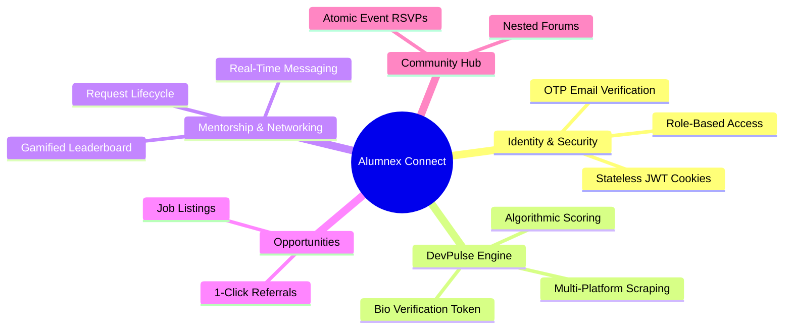

# 📌 Alumnex Connect - Affinity Diagram (FigJam Style)

Welcome to the digital Affinity Diagram for **Alumnex Connect**. This document organizes our brainstorming, feature requirements, and user insights into distinct thematic clusters—just like organizing sticky notes on a FigJam whiteboard!

---

## 🗺️ High-Level Mind Map

Here is a visual overview of how the core domains of Alumnex Connect relate to each other:



---

## 🗂️ Thematic Clusters (Sticky Notes)

Below are the detailed "sticky notes" grouped by their affinity. Think of each block as a specific colored sticky note placed on the board by a team member.

### 🟡 Cluster 1: Identity & Security (The Foundation)
> [!NOTE]
> **Focus:** How users enter the system and what they are allowed to do.
- **Sticky 1:** "Need a way to verify students are actually from the college. Let's use OTP via email!"
- **Sticky 2:** "Authentication must be super secure. Let's strictly use `httpOnly` cookies so XSS attacks can't steal the JWT."
- **Sticky 3:** "Different roles need different views. Students can't post jobs, but Alumni can. We need a solid RBAC (Role-Based Access Control) matrix."

### 🔵 Cluster 2: DevPulse (The Flex)
> [!TIP]
> **Focus:** Aggregating developer skills automatically.
- **Sticky 1:** "Students shouldn't have to manually enter their LeetCode stats. Let's scrape them!"
- **Sticky 2:** "Wait, how do we know they own that LeetCode account? Let's make them put a verification code (`ALUMNEX_VERIFY_XXXX`) in their bio."
- **Sticky 3:** "We need a combined score (Alumnex Score) to rank students on a leaderboard. Makes it competitive and fun!"
- **Sticky 4:** "Scraping 6 sites at once might take too long. We MUST use `Promise.allSettled()` with a 4-second timeout to prevent the UI from hanging."

### 🟢 Cluster 3: Mentorship & Networking (The Core Value)
> [!IMPORTANT]
> **Focus:** Connecting students with alumni seamlessly.
- **Sticky 1:** "Students should be able to request mentorship, but Alumni must have the power to Accept or Reject."
- **Sticky 2:** "Let's incentivize Alumni to mentor! We can give them 'Mentor Points' and badges for completing sessions."
- **Sticky 3:** "Chat needs to be real-time. Socket.IO is perfect here."
- **Sticky 4:** "What if the user is offline when a message is sent? The system should fall back to an email notification (Nodemailer)."

### 🟣 Cluster 4: Career Opportunities (The Goal)
> [!TIP]
> **Focus:** Getting students hired.
- **Sticky 1:** "Alumni should be able to post internships and full-time jobs."
- **Sticky 2:** "Referrals are huge. Let's add a '1-Click Referral DM' button so students can easily ask an Alumni for a referral with their resume attached."

### 🟠 Cluster 5: Community & Events (The Engagement)
> [!WARNING]
> **Focus:** Keeping the platform active and handling high traffic.
- **Sticky 1:** "Colleges need to host events. Students can RSVP."
- **Sticky 2:** "CONCURRENCY ISSUE: What if 500 students RSVP for a 50-seat event at the exact same time? We need MongoDB Atomic `$expr` operators to prevent overselling!"
- **Sticky 3:** "We need a forum for general questions. Let's allow nested replies (like Reddit), but cap the depth to 2 levels to keep the database fast."

---

## 🔄 User Journey Flows (Whiteboard Connectors)

In FigJam, you often draw arrows between sticky notes to show flow. Here is how our clusters interact:

```mermaid
flowchart LR
    A[Student Registers (Identity)] --> B[Links GitHub/LeetCode (DevPulse)]
    B --> C[Appears on Leaderboard (DevPulse)]
    C --> D[Requests Mentorship (Networking)]
    D --> E[Alumni Mentors & Gets Points (Networking)]
    E --> F[Alumni posts Job/Referral (Opportunities)]
    A --> F
```

## 🎯 Action Items / Next Steps
- [x] Define User Roles
- [x] Architecture & Database Schema
- [ ] Implement DevPulse Scraping logic
- [ ] Build Real-time Socket.IO chat
- [ ] Setup CI/CD Pipeline (Render/Vercel)
