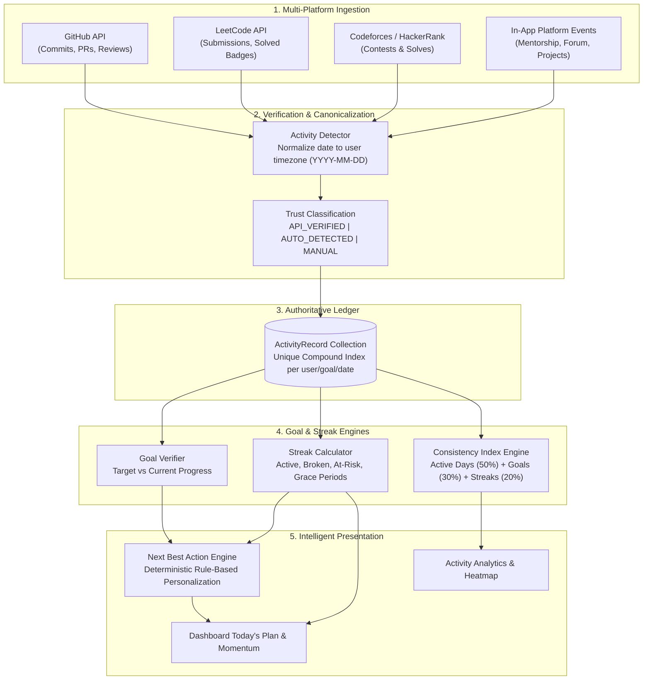
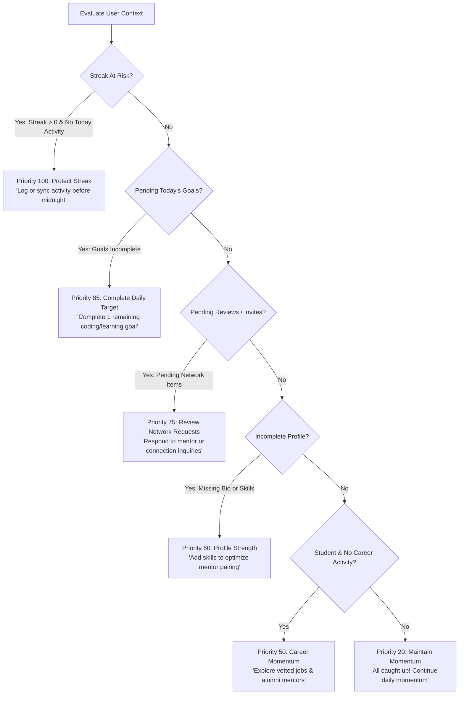

# Activity Hub & Next Best Action Intelligence Engine

## 1. Architectural Philosophy

Activity Hub serves as the **behavioral intelligence engine** of Alumnex Connect. Rather than acting as a passive log of statistics, it answers the primary question:

> **"WHAT SHOULD I DO TODAY TO ACCELERATE MY CAREER & MAINTAIN MOMENTUM?"**

---

## 2. End-to-End Processing Pipeline

---

## 3. Trust Classification Matrix

To protect ecosystem integrity and prevent artificial gamification, activities are strictly partitioned:

| Classification | Source | Verification Method | Visual Indicator |
| :--- | :--- | :--- | :--- |
| **API_VERIFIED** | GitHub, LeetCode, Codeforces | Direct OAuth / REST / GraphQL polling with cryptographic commit SHA or submission ID | Emerald Badge + ShieldCheck Icon |
| **AUTO_DETECTED** | Alumnex Internal Actions | System events (e.g. mentor session completed, forum post reviewed, PR merged) | Indigo Badge + Zap Icon |
| **MANUAL** | User self-reported | User manual submission with optional proof link | Neutral Gray Badge + Clock Icon |

*Rule: Manually entered tasks can NEVER receive the API_VERIFIED tag.*

---

## 4. Next Best Action (NBA) Engine Rules

The Next Best Action engine evaluates real user signals in strict priority order:

---

## 5. Responsive Engineering Patterns

In accordance with Alumnex engineering standards:
1. **Container Constraint**: `w-full max-w-7xl mx-auto px-4 sm:px-6 lg:px-8 min-w-0`
2. **Adaptive Personal Records**:
   - `< 640px` (Mobile): `grid-cols-1`
   - `640px - 1023px` (Tablet): `grid-cols-2`
   - `1024px - 1535px` (Laptop / Intermediate): `grid-cols-3` (providing >260px minimum card width)
   - `>= 1536px` (Wide Desktop): `grid-cols-5`
3. **Internal Visualization Scrolling**:
   - Full 52-week calendars use `overflow-x-auto touch-pan-x custom-scrollbar` scoped strictly to the chart viewport.
   - The document body is NEVER clipped with `overflow-x: hidden`.
