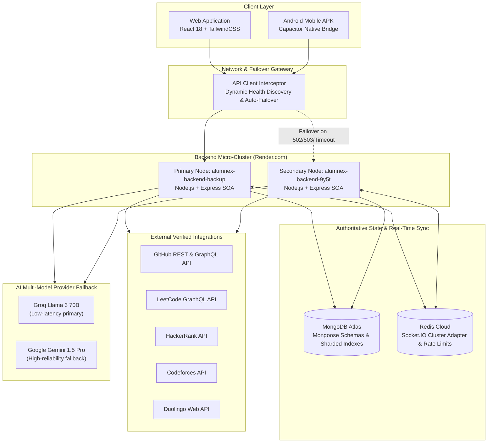
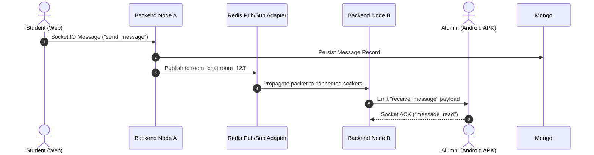
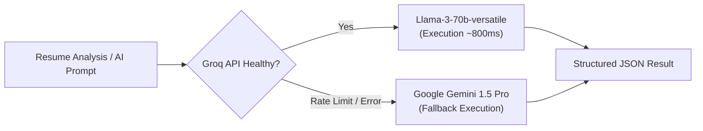

# Alumnex Connect — System Architecture & High Availability (HA) Specification

## 1. System Overview

Alumnex Connect is an enterprise-grade mentorship, career, and developer momentum ecosystem. It unifies professional networking, real-time messaging, multi-platform developer tracking, AI-powered resume analysis, and behavioral habit intelligence into a single coherent web and mobile application.

---

## 2. High-Availability (HA) Failover Architecture

### Dual-Endpoint Cluster
The client-side API layer maintains active awareness of the backend cluster:
- **Primary Endpoint**: `https://alumnex-backend-backup.onrender.com/api`
- **Secondary Endpoint**: `https://alumnex-backend-9y5t.onrender.com/api`

### Client Discovery & Heartbeat Lifecycle
1. **Bootstrap Discovery**: On application boot, `discoverFastestEndpoint()` issues parallel non-blocking `GET /health` requests with a 3,500ms timeout.
2. **Instant Latch**: The fastest healthy node is dynamically latched into memory and `localStorage['alumnex_api_base_url']`.
3. **Outage Recovery**: If any active request receives HTTP `502 Bad Gateway`, `503 Service Unavailable`, `504 Gateway Timeout`, or network disconnect:
   - The interceptor immediately switches endpoints.
   - The failed request is transparently re-attempted against the backup node without user disruption.
   - Cross-domain credentials (`withCredentials: true`) and Bearer JWT tokens are preserved across failover transitions.

---

## 3. Real-Time Distributed Messaging

- **Socket.IO Cluster Adapter**: Enables seamless two-way real-time messaging even when clients are connected across distinct backend instances.
- **Presence & Read Receipts**: Stored in Redis memory with automatic TTL expiry to prevent stale online indicators.

---

## 4. AI Multi-Provider Fallback Architecture

1. **Primary Model**: Groq `llama-3.3-70b-versatile` provides near instantaneous response times for resume parsing and skill gap extraction.
2. **Deterministic Fallback**: If Groq encounters rate limiting (`429`), timeouts, or quota exhaustion, execution seamlessly routes to Google Gemini `gemini-1.5-pro`.
3. **JSON Sanitization**: Both providers enforce strict JSON schema output with server-side validation before returning to clients.

---

## 5. Security & Defensive Engineering

- **Authentication**: Dual-mode auth supporting HTTP-Only SameSite cookies and standard `Authorization: Bearer <JWT>` headers for native mobile compatibility.
- **CSRF Protection**: Double-submit cookie verification enabled in production.
- **Data Sanitization**: `express-mongo-sanitize` strips `$` and `.` operators to eliminate NoSQL injection vectors.
- **HTTP Hardening**: Helmet sets strict Content-Security-Policy (CSP), `X-Frame-Options: SAMEORIGIN`, `X-Content-Type-Options: nosniff`, and Referrer Policy.
- **Rate Limiting**: Distributed IP rate-limiting via Express Rate Limit backed by Redis storage.
